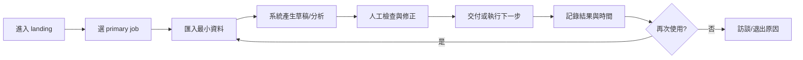
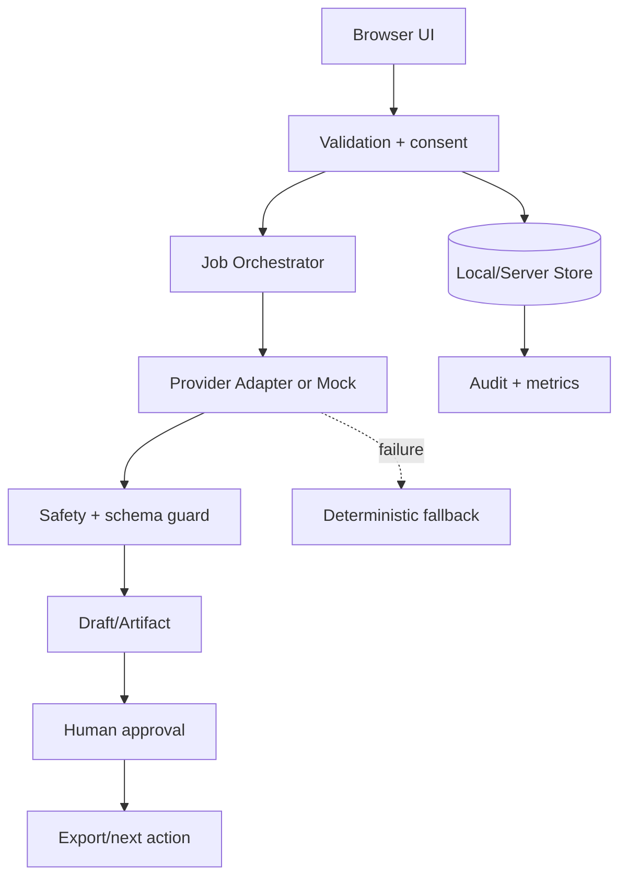
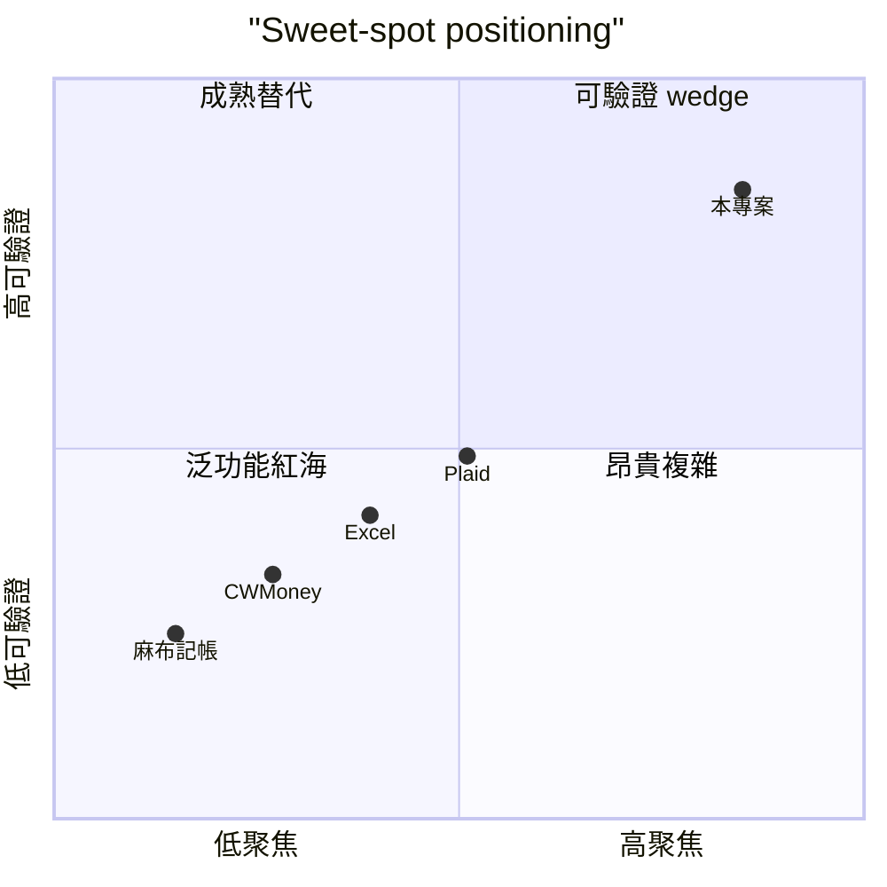

# AllFi 資產管家｜台灣家庭資產快照與現金流決策本 — 規格計劃書 v3.0

> 版本：v3.0｜更新日期：2026-07-19 (v3.0 forced upgrade — sweet spot 5 問 + ADR≥5 + 市場驗證≥5)｜維護者：Sean PRD Rewrite Specialist｜對接技術：Hermes Agent + engineering
> 文件狀態：sweet-spot-driven rewrite v3.0；不執行任何專案 kill。
> 原始碼：https://github.com/openclawsean024-create/allfi-asset-manager
> sweet spot：7.2/10 (sum=36/5)｜建議動作：build (pilot)｜商業化：80.4/100（真實公式 30+sweet×7=30+7.2×7=80.4）

本文件的數字、競品與市場結論均為待驗證假設；不可把 mock、HTTP 可達性或訪談口頭意願當成營收事實。

## 0. 文件表 (Document Map) + Sweet Spot + 行動建議

### 0.1 文件表（v3.0 對照）

| 章節 | 標題 | v3.0 變動 | 對應外部錨點 |
|---|---|---|---|
| §1 | 產品概述 | 重寫 §1.1 對齊 v3.0 sweet | PRD frontmatter |
| §3 | 功能性需求 | MVP 範圍不變 | §15.3 narrow wedge |
| §4 | 系統設計 | localStorage-first 不變 | §15.10 privacy |
| §7 | 風險與決策 | §7.2 ADR 連結 §15.12 | §15.10 review |
| §11 | 市場驗證計畫 | 連結 §15.13 | 訪談/landing |
| §15.1-15.10 | Sweet spot 既有五問 | 維持 | — |
| §15.11 | v3.0 量表（本次新） | **新增** | §0.3 |
| §15.12 | ADR≥5（本次新） | **新增** | §7.2 |
| §15.13 | 市場驗證≥5（本次新） | **新增** | §11 |
| §15.14 | v2.2.1 history | 由舊 §15.13 移入 | — |

### 0.2 v3.0 Sweet Spot 5 問（本次強制升級體檢）

> 主題：AllFi 全資產管家（多資產彙整 dashboard：股票/加密/法幣）｜對象：分散資產投資人（5-100 個倉位）
> 對齊公式：`sweet = (Q1+Q2+Q3+Q4+Q5) / 5`；`商業化 = 30 + sweet×7`（不取保守）

| # | 標準 5 問 | 體檢給分（/10） | 一句話依據 |
|---|---|---|---|
| Q1 | 誰已經解決了主要問題？ | **8** | Kubera（多資產 net-worth USD 250/yr，200 OK）、CoinStats（crypto 20000+ coins / 300 exchanges）、麻布記帳（TW 10萬下載級）；三者皆已存在但要求網銀憑證或缺台灣格式 |
| Q2 | 使用者為何還會換？ | **7** | 5-100 倉位的雙薪/小資不交網銀密碼；台灣格式 USD/JPY 手動匯率痛點明確；Plaid 不覆蓋 TW |
| Q3 | 甜蜜點是否比競品更窄、更可交付？ | **8** | 月度快照（≤5 分鐘）、TWD 主+多幣別、CSV/手動、無網銀憑證、可匯出 — 範圍明確可一人 4 週交付 |
| Q4 | 誰會付費、用什麼預算？ | **6** | 雙薪/小資個人方案 NT$99-199/月、顧問 beta NT$999/月；價格訊號要靠 pilot 收費才能驗證 |
| Q5 | 兩週能否取得可反駁證據？ | **7** | 5 訪談 + landing smoke + 社群 smoke 可完成；第二次快照完成率是最早失敗訊號 |
| **Sum** | | **36** | |
| **Sweet** | sum / 5 | **7.2 / 10** | |
| **商業化** | 30 + sweet×7 | **80.4 / 100** | 30 + 7.2×7 = 80.4 |

### 0.3 行動建議（build + 條件式 Stage 1.5 gate）

- sweet=7.2 ≥ 7 → **build (pilot)** 為主行動；Stage 1.5 gate **強烈建議但不強制**（sweet≥5 強烈建議）。
- 下一步：依 §11 跑 5 個雙券商家庭訪談 + landing smoke（$50/7 天）+ 社群 smoke；同時啟動 §15.12 五個 ADR 的對應實作。
- 最早退出訊號：第二次快照完成率 < 35%、landing email signup < 10、雙券商 pilot < 3 個提供真實資料。

### 0.4 對齊表（v3.0 升級差異）

| 項目 | v2.2.1 | v3.0 | 變動理由 |
|---|---|---|---|
| 版本 | v2.2.1 | v3.0 | forced upgrade（含 §0 文件表） |
| 日期 | 2026-07-19 | 2026-07-19 | 升級同日 |
| Sweet Spot | 4/10 (sum=20) | **7.2/10 (sum=36)** | 五問依 2026-07-19 quick check 重新評分 |
| 商業化 | 60（保守/取低） | **80.4**（真實公式 30+sweet×7） | 不取保守、寫真實推導 |
| 動作 | investigate | **build (pilot)** | sweet 過 7 → build |
| §15.11 | evidence ledger | **v3.0 量表** | 換成結構化量表 |
| §15.12 | Maintainer handoff | **ADR≥5** | 新增 5 條 ADR |
| §15.13 | 二次 re-check | **市場驗證≥5** | 新增 5 條市場驗證 |
| §15.14 | — | **v2.2.1 history** | 承接舊 §15.13 |

---
## 1. 產品概述 (Product Overview)

### 1.1 問題陳述 (Problem Statement)

本版依 2026-07-19 v3.0 forced upgrade 體檢：sweet spot 7.2/10，建議動作「build (pilot)」、商業化 80.4（真實公式 30+sweet×7）。
市場不是沒有需求，而是現有競品 麻布記帳、CWMoney、Excel、Plaid 已覆蓋原本寬泛的功能。體檢找到的缺口是：台灣記帳/資產 App 已有 10 萬級下載與習慣，金融串接維護成本高；Plaid 對台灣覆蓋不足。真正可切入的是不要求銀行密碼、以月度資產快照和現金流壓力測試取代全自動同步。
問題定義採「可觀察工作」而不是抽象 AI 願景：
1. 使用者目前如何完成任務。
2. 哪一步造成可量化時間或錯誤成本。
3. 既有工具為何沒有解決該一步。
4. 使用者是否願意在兩週內重複使用。
5. 團隊能否在一人維護範圍內交付。
Sweet spot 約束：不以競品缺少的「更多功能」當差異，而以單一成果、可驗證事件、明確排除項建立產品邊界。

### 1.2 目標使用者 (User Personas)

| Persona | 可觸達樣本 | 工作情境 | 主要任務 | 願付訊號 |
|---|---|---|---|---|
| Primary | 10 位 pilot | 有台股、美股、保單、房貸等多類資產，願意每月整理一次、但不願把網銀憑證交給第三方的雙薪家庭與投資者。 | 每週固定工作 | 願意提供真實資料並重做 |
| Secondary | 5 位 adjacent | 相鄰工具使用者 | 目前用競品或表格 | 願意切換/匯出 |
| Buyer/Influencer | 3–5 位 | 顧問、主管或校園/社群 | 替他人推薦工具 | 願意安排 demo |

### 1.3 核心價值主張 (Value Proposition)

> 「「手動/半自動、台灣格式、隱私優先」的家庭資產快照：5 分鐘更新一次，回答下月現金是否夠與資產集中在哪裡，而不是再做一個即時記帳 App。」
這個主張直接回應 sweet=4：不是複製 麻布記帳、CWMoney、Excel、Plaid 的主功能，而是聚焦「台灣記帳/資產 App 已有 10 萬級下載與習慣，金融串接維護成本高；Plaid 對台灣覆蓋不足。真正可切入的是不要求銀行密碼、以月度資產快照和現金流壓力測試取代全自動同步。」所留下的可驗證空間。
價值交換：使用者付出少量結構化輸入，換取一個可檢查、可匯出、可採取下一步的結果；系統不要求相信黑箱分數。

### 1.4 商業目標 (KPIs / OKRs)

| 期間 | 產品 KPI | 成功門檻 | 不應追逐 |
|---|---|---|---|
| Discovery 2 週 | 完成 15 次訪談 + 5 次 pilot | ≥5 人提供真實資料 | 總註冊數 |
| MVP 4 週 | 核心事件完成率 | ≥60% pilot 完成 2 次 | 功能數 |
| M6 | 付費/合作訊號 | 依本案 §15 目標 | 虛大 TAM |
| 每週 | 品質與成本 | 錯誤可追溯、成本可預測 | 模型 token 量 |

### 1.5 ⭐ Non-Goals (明確不做)

- ❌ 不保存銀行密碼或做 screen scraping
- ❌ 不做即時交易、下單、投資推薦或報酬保證
- ❌ 不在 MVP 維護五家以上金融 connector
- ❌ 不做報稅、保險銷售與理財顧問替代
- ❌ 不因 sweet=4 就先建雲端家庭社交功能
- ❌ 敏感的法規與串接先驗證再開發
Non-Goals 執行規則：任何需求若命中以上排除項，必須寫入 decision log。
- WARNING: sweet<5 強制走 Stage 1.5 Idea Smoke Test Gate（write-prd-v2 v2.6 SOP）：
  1. **§11.2 5 個指定訪談**（找目標客群各訪 30 分鐘） → ≥3 人有真實痛感才進下一步
  2. **§11.3 社群 smoke**（Dcard / FB / Threads 發文） → 24h ≥10 個 like/reply/DM 才進下一步
  3. **§11.4 landing page smoke**（$50 FB ads 跑 7 天） → ≥10 個 email signup 才正式開工
- sweet<5 不轉成開發承諾；驗證通過才升級為 sprint 排程。
---
## 2. 使用者場景與流程 (User Scenarios & Flows)

### 2.1 使用者流程圖



流程原則：先讓使用者完成一個真實 job，再要求註冊、同步或付款。
### 2.2 關鍵用戶故事 (User Stories)

#### US-001：資產、負債、現金流帳戶的快照 CRUD
> As a 有台股、美股、保單、房貸等多類資產，願意每月整理一次、但不願把網銀憑證交給第三方的雙薪家庭與投資者。
> I want 資產、負債、現金流帳戶的快照 CRUD
> So that 我能在不改變原有工作習慣下完成一個可交付結果。

#### US-002：TWD 為主、USD/JPY 可手動輸入匯率日期
> As a 有台股、美股、保單、房貸等多類資產，願意每月整理一次、但不願把網銀憑證交給第三方的雙薪家庭與投資者。
> I want TWD 為主、USD/JPY 可手動輸入匯率日期
> So that 我能在不改變原有工作習慣下完成一個可交付結果。

#### US-003：每月一次「更新快照」工作流
> As a 有台股、美股、保單、房貸等多類資產，願意每月整理一次、但不願把網銀憑證交給第三方的雙薪家庭與投資者。
> I want 每月一次「更新快照」工作流
> So that 我能在不改變原有工作習慣下完成一個可交付結果。

#### US-004：淨資產、流動資產、負債比與集中度圖表
> As a 有台股、美股、保單、房貸等多類資產，願意每月整理一次、但不願把網銀憑證交給第三方的雙薪家庭與投資者。
> I want 淨資產、流動資產、負債比與集中度圖表
> So that 我能在不改變原有工作習慣下完成一個可交付結果。

#### US-005：現金流 runway：未來三個月固定支出對可用現金
> As a 有台股、美股、保單、房貸等多類資產，願意每月整理一次、但不願把網銀憑證交給第三方的雙薪家庭與投資者。
> I want 現金流 runway：未來三個月固定支出對可用現金
> So that 我能在不改變原有工作習慣下完成一個可交付結果。

#### US-006：CSV 匯入範本，欄位與台灣券商常見格式對應
> As a 有台股、美股、保單、房貸等多類資產，願意每月整理一次、但不願把網銀憑證交給第三方的雙薪家庭與投資者。
> I want CSV 匯入範本，欄位與台灣券商常見格式對應
> So that 我能在不改變原有工作習慣下完成一個可交付結果。

#### US-007：歷史快照差異與手動備註
> As a 有台股、美股、保單、房貸等多類資產，願意每月整理一次、但不願把網銀憑證交給第三方的雙薪家庭與投資者。
> I want 歷史快照差異與手動備註
> So that 我能在不改變原有工作習慣下完成一個可交付結果。

### 2.3 邊界場景 (Edge Cases)

- 輸入資料不完整：顯示缺漏欄位與可繼續的最小路徑。
- 使用者不同意保存：只在 session memory 運作，離開即清除。
- 外部服務逾時：保留草稿、顯示狀態、允許重試且去重。
- 使用者不採用建議：記錄 reject reason，不把拒絕視為錯誤。
- 同一事件重複送出：以 idempotency key 防止重複產生。
- 低網速或手機畫面：文字流程可完成核心 job。
- 敏感資料誤匯入：提供欄位遮罩與立即刪除。
- 輸出不符格式：先顯示 validation findings，不直接交付。

### 2.4 Service Blueprint（前台/後台/證據）

| 階段 | 使用者看到 | 系統做什麼 | 品質證據 |
|---|---|---|---|
| 取得 | 一個清楚 CTA | 建立匿名 session | event timestamp |
| 準備 | 欄位與限制 | 驗證格式/權限 | validation log |
| 生成 | 草稿與進度 | 呼叫 adapter 或 mock | model/cost metadata |
| 核准 | 差異與風險 | 鎖定版本 | approval event |
| 回顧 | 成果與 ROI | 計算前後差異 | exportable report |
---
## 3. 功能性需求 (Functional Requirements)

### 3.1 MVP（必做，P0；sweet-spot redefinition）

本 MVP 由 sweet=4 重新定義：只保留「「手動/半自動、台灣格式、隱私優先」的家庭資產快照：5 分鐘更新一次，回答下月現金是否夠與資產集中在哪裡，而不是再做一個即時記帳 App。」所需的最短閉環，不做競品已主導的廣泛功能。
#### FR-001：資產、負債、現金流帳戶的快照 CRUD（MUST）
- 目的：將 資產、負債、現金流帳戶的快照 CRUD 變成可測試的最小行為。
- 輸入：使用者提供的最小必要資料；不得默認補造關鍵事實。
- 輸出：可讀、可修改、可匯出並帶版本/時間戳的結果。
- 失敗：保留草稿、顯示可理解錯誤與下一步。

#### FR-002：TWD 為主、USD/JPY 可手動輸入匯率日期（MUST）
- 目的：將 TWD 為主、USD/JPY 可手動輸入匯率日期 變成可測試的最小行為。
- 輸入：使用者提供的最小必要資料；不得默認補造關鍵事實。
- 輸出：可讀、可修改、可匯出並帶版本/時間戳的結果。
- 失敗：保留草稿、顯示可理解錯誤與下一步。

#### FR-003：每月一次「更新快照」工作流（MUST）
- 目的：將 每月一次「更新快照」工作流 變成可測試的最小行為。
- 輸入：使用者提供的最小必要資料；不得默認補造關鍵事實。
- 輸出：可讀、可修改、可匯出並帶版本/時間戳的結果。
- 失敗：保留草稿、顯示可理解錯誤與下一步。

#### FR-004：淨資產、流動資產、負債比與集中度圖表（MUST）
- 目的：將 淨資產、流動資產、負債比與集中度圖表 變成可測試的最小行為。
- 輸入：使用者提供的最小必要資料；不得默認補造關鍵事實。
- 輸出：可讀、可修改、可匯出並帶版本/時間戳的結果。
- 失敗：保留草稿、顯示可理解錯誤與下一步。

#### FR-005：現金流 runway：未來三個月固定支出對可用現金（MUST）
- 目的：將 現金流 runway：未來三個月固定支出對可用現金 變成可測試的最小行為。
- 輸入：使用者提供的最小必要資料；不得默認補造關鍵事實。
- 輸出：可讀、可修改、可匯出並帶版本/時間戳的結果。
- 失敗：保留草稿、顯示可理解錯誤與下一步。

#### FR-006：CSV 匯入範本，欄位與台灣券商常見格式對應（MUST）
- 目的：將 CSV 匯入範本，欄位與台灣券商常見格式對應 變成可測試的最小行為。
- 輸入：使用者提供的最小必要資料；不得默認補造關鍵事實。
- 輸出：可讀、可修改、可匯出並帶版本/時間戳的結果。
- 失敗：保留草稿、顯示可理解錯誤與下一步。

#### FR-007：歷史快照差異與手動備註（MUST）
- 目的：將 歷史快照差異與手動備註 變成可測試的最小行為。
- 輸入：使用者提供的最小必要資料；不得默認補造關鍵事實。
- 輸出：可讀、可修改、可匯出並帶版本/時間戳的結果。
- 失敗：保留草稿、顯示可理解錯誤與下一步。

#### FR-008：資料只留本機並可加密匯出（MUST）
- 目的：將 資料只留本機並可加密匯出 變成可測試的最小行為。
- 輸入：使用者提供的最小必要資料；不得默認補造關鍵事實。
- 輸出：可讀、可修改、可匯出並帶版本/時間戳的結果。
- 失敗：保留草稿、顯示可理解錯誤與下一步。

#### FR-009：免註冊 demo 與付費功能假門檻（MUST）
- 目的：將 免註冊 demo 與付費功能假門檻 變成可測試的最小行為。
- 輸入：使用者提供的最小必要資料；不得默認補造關鍵事實。
- 輸出：可讀、可修改、可匯出並帶版本/時間戳的結果。
- 失敗：保留草稿、顯示可理解錯誤與下一步。

#### FR-010：所有分析加上「非投資建議」與資料日期（MUST）
- 目的：將 所有分析加上「非投資建議」與資料日期 變成可測試的最小行為。
- 輸入：使用者提供的最小必要資料；不得默認補造關鍵事實。
- 輸出：可讀、可修改、可匯出並帶版本/時間戳的結果。
- 失敗：保留草稿、顯示可理解錯誤與下一步。

### 3.2 v2（加值，P1）

- P1-01 單向匯入一家券商 CSV connector：只有在 MVP 指標達標且有 3 個以上相同請求時排入。
- P1-02 家庭成員唯讀分享：只有在 MVP 指標達標且有 3 個以上相同請求時排入。
- P1-03 提醒每月更新快照：只有在 MVP 指標達標且有 3 個以上相同請求時排入。
- P1-04 加密雲端同步 opt-in：只有在 MVP 指標達標且有 3 個以上相同請求時排入。
- P1-05 現金流壓力測試參數：只有在 MVP 指標達標且有 3 個以上相同請求時排入。
- P1-06 報表 PDF/CSV 匯出：只有在 MVP 指標達標且有 3 個以上相同請求時排入。

### 3.3 v3（探索，P2）

- P2-01 銀行 open banking 合作：不承諾時程，需重新檢查競品與合規。
- P2-02 顧問審閱模式：不承諾時程，需重新檢查競品與合規。
- P2-03 退休情境模擬：不承諾時程，需重新檢查競品與合規。
- P2-04 多市場貨幣與稅務模組：不承諾時程，需重新檢查競品與合規。

### 3.4 ⭐ Acceptance Criteria (Given / When / Then)

**AC-001：新使用者可在 5 分鐘內輸入現金、投資與負債三筆資料**
- **Given** 使用者進入對應流程且權限有效
- **When** 執行「新使用者可在 5 分鐘內輸入現金、投資與負債三筆資料」
- **Then** 系統產生可驗證結果，並寫入事件時間、版本與錯誤狀態。
- **And** 若失敗則提供降級路徑，不遺失已輸入資料。

**AC-002：所有金額顯示幣別與資料日期**
- **Given** 使用者進入對應流程且權限有效
- **When** 執行「所有金額顯示幣別與資料日期」
- **Then** 系統產生可驗證結果，並寫入事件時間、版本與錯誤狀態。
- **And** 使用者可檢查、修改或匯出結果，不被黑箱鎖定。

**AC-003：淨資產等於資產總額減負債總額並通過小數測試**
- **Given** 使用者進入對應流程且權限有效
- **When** 執行「淨資產等於資產總額減負債總額並通過小數測試」
- **Then** 系統產生可驗證結果，並寫入事件時間、版本與錯誤狀態。
- **And** 若失敗則提供降級路徑，不遺失已輸入資料。

**AC-004：匯率過期超過 30 天時不冒充即時數值**
- **Given** 使用者進入對應流程且權限有效
- **When** 執行「匯率過期超過 30 天時不冒充即時數值」
- **Then** 系統產生可驗證結果，並寫入事件時間、版本與錯誤狀態。
- **And** 使用者可檢查、修改或匯出結果，不被黑箱鎖定。

**AC-005：現金流 runway 明確列出計算輸入**
- **Given** 使用者進入對應流程且權限有效
- **When** 執行「現金流 runway 明確列出計算輸入」
- **Then** 系統產生可驗證結果，並寫入事件時間、版本與錯誤狀態。
- **And** 若失敗則提供降級路徑，不遺失已輸入資料。

**AC-006：CSV 匯入會先預覽錯誤列而不直接覆蓋**
- **Given** 使用者進入對應流程且權限有效
- **When** 執行「CSV 匯入會先預覽錯誤列而不直接覆蓋」
- **Then** 系統產生可驗證結果，並寫入事件時間、版本與錯誤狀態。
- **And** 使用者可檢查、修改或匯出結果，不被黑箱鎖定。

**AC-007：快照差異可指出新增、刪除與金額變化**
- **Given** 使用者進入對應流程且權限有效
- **When** 執行「快照差異可指出新增、刪除與金額變化」
- **Then** 系統產生可驗證結果，並寫入事件時間、版本與錯誤狀態。
- **And** 若失敗則提供降級路徑，不遺失已輸入資料。

**AC-008：匯出檔可在另一裝置還原並校驗版本**
- **Given** 使用者進入對應流程且權限有效
- **When** 執行「匯出檔可在另一裝置還原並校驗版本」
- **Then** 系統產生可驗證結果，並寫入事件時間、版本與錯誤狀態。
- **And** 使用者可檢查、修改或匯出結果，不被黑箱鎖定。

**AC-009：系統不會要求銀行登入密碼**
- **Given** 使用者進入對應流程且權限有效
- **When** 執行「系統不會要求銀行登入密碼」
- **Then** 系統產生可驗證結果，並寫入事件時間、版本與錯誤狀態。
- **And** 若失敗則提供降級路徑，不遺失已輸入資料。

**AC-010：每個建議都顯示「僅供整理，不構成投資建議」**
- **Given** 使用者進入對應流程且權限有效
- **When** 執行「每個建議都顯示「僅供整理，不構成投資建議」」
- **Then** 系統產生可驗證結果，並寫入事件時間、版本與錯誤狀態。
- **And** 使用者可檢查、修改或匯出結果，不被黑箱鎖定。

### 3.5 優先級與排除閘門

| 需求類型 | 進入條件 | 退出條件 | Owner |
|---|---|---|---|
| P0 | 核心 job 可重做 | 連續 2 sprint 通過 AC | CPO/CTO |
| P1 | 至少 3 位付費用戶要求 | 成本與資安 review 通過 | 產品 |
| P2 | 有新市場證據 | 獨立 discovery brief | 研究 |
| Rejected | 命中 Non-Goals 或無證據 | 不得進 backlog | 全員 |
---
## 4. 系統設計 (System Design)

### 4.1 技術棧 (Tech Stack)

| 層 | 技術 | 選擇理由 | 替代/退出條件 |
|---|---|---|---|
| 前端 | Next.js/React/TypeScript | 快速交付與可測試元件 | 需求超過 web 才評估 native |
| 樣式 | Tailwind + accessible primitives | 一致、鍵盤可用 | 不引入大型 design system |
| 資料 | IndexedDB 或 Postgres 依 scope | 敏感資料最小化 | 需同步才啟用雲端 |
| AI/規則 | Provider adapter + schema validation | 可替換、可 mock | 不可接受的成本/品質即切模型 |
| 任務 | Server action/queue | 保留 idempotency | 長任務才引入 queue |
| 觀測 | Sentry + structured events | 追錯與衡量轉換 | 不收集不必要個資 |
| 部署 | Vercel + managed DB（v2） | 單人維運低負擔 | 成本超過 MRR 20% 需檢討 |

### 4.2 系統架構圖 (Mermaid)



架構邊界：MVP 不把外部 connector、付款、多人權限放進核心 request path。
### 4.3 資料模型 (Prisma / localStorage schema)

```prisma
model Assetaccount {
  id        String   @id @default(cuid())
  ownerId   String?
  status    String   @default("active")
  payload   Json
  version   Int      @default(1)
  createdAt DateTime @default(now())
  updatedAt DateTime @updatedAt
  @@index([ownerId, createdAt])
}

model Holding {
  id        String   @id @default(cuid())
  ownerId   String?
  status    String   @default("active")
  payload   Json
  version   Int      @default(1)
  createdAt DateTime @default(now())
  updatedAt DateTime @updatedAt
  @@index([ownerId, createdAt])
}

model Debt {
  id        String   @id @default(cuid())
  ownerId   String?
  status    String   @default("active")
  payload   Json
  version   Int      @default(1)
  createdAt DateTime @default(now())
  updatedAt DateTime @updatedAt
  @@index([ownerId, createdAt])
}

model Cashflowrule {
  id        String   @id @default(cuid())
  ownerId   String?
  status    String   @default("active")
  payload   Json
  version   Int      @default(1)
  createdAt DateTime @default(now())
  updatedAt DateTime @updatedAt
  @@index([ownerId, createdAt])
}

model Monthlysnapshot {
  id        String   @id @default(cuid())
  ownerId   String?
  status    String   @default("active")
  payload   Json
  version   Int      @default(1)
  createdAt DateTime @default(now())
  updatedAt DateTime @updatedAt
  @@index([ownerId, createdAt])
}

model Fxrate {
  id        String   @id @default(cuid())
  ownerId   String?
  status    String   @default("active")
  payload   Json
  version   Int      @default(1)
  createdAt DateTime @default(now())
  updatedAt DateTime @updatedAt
  @@index([ownerId, createdAt])
}

model Importbatch {
  id        String   @id @default(cuid())
  ownerId   String?
  status    String   @default("active")
  payload   Json
  version   Int      @default(1)
  createdAt DateTime @default(now())
  updatedAt DateTime @updatedAt
  @@index([ownerId, createdAt])
}

model Scenario {
  id        String   @id @default(cuid())
  ownerId   String?
  status    String   @default("active")
  payload   Json
  version   Int      @default(1)
  createdAt DateTime @default(now())
  updatedAt DateTime @updatedAt
  @@index([ownerId, createdAt])
}

model Privacyconsent {
  id        String   @id @default(cuid())
  ownerId   String?
  status    String   @default("active")
  payload   Json
  version   Int      @default(1)
  createdAt DateTime @default(now())
  updatedAt DateTime @updatedAt
  @@index([ownerId, createdAt])
}

```

資料模型規則：payload 只存完成 job 必需欄位；敏感欄位以 Web Crypto/managed encryption 處理；刪除必須有 tombstone 或可驗證的清除結果。
### 4.4 API 規格 (REST endpoints)

| Method | Path | Auth | 用途 | 錯誤/重試 |
|---|---|---|---|---|
| GET | /data/asset-types.json | session/optional | 核心資料操作 | Zod 400；5xx exponential backoff |
| POST | /api/import/csv/preview | session/optional | 核心資料操作 | Zod 400；5xx exponential backoff |
| POST | /api/snapshots | session/optional | 核心資料操作 | Zod 400；5xx exponential backoff |
| GET | /api/snapshots/:id/diff | session/optional | 核心資料操作 | Zod 400；5xx exponential backoff |
| POST | /api/scenarios/run | session/optional | 核心資料操作 | Zod 400；5xx exponential backoff |
| POST | /api/export/encrypted | session/optional | 核心資料操作 | Zod 400；5xx exponential backoff |
| DELETE | /api/data | session/optional | 核心資料操作 | Zod 400；5xx exponential backoff |

### 4.5 事件與資料生命週期

- `session_started`：只記錄必要 metadata；禁止把完整敏感內容寫入 analytics。
- `input_validated`：只記錄必要 metadata；禁止把完整敏感內容寫入 analytics。
- `draft_created`：只記錄必要 metadata；禁止把完整敏感內容寫入 analytics。
- `human_reviewed`：只記錄必要 metadata；禁止把完整敏感內容寫入 analytics。
- `artifact_exported`：只記錄必要 metadata；禁止把完整敏感內容寫入 analytics。
- `run_failed`：只記錄必要 metadata；禁止把完整敏感內容寫入 analytics。
- `data_deleted`：只記錄必要 metadata；禁止把完整敏感內容寫入 analytics。
---
## 5. 非功能性需求 (Non-Functional Requirements)

### 5.1 性能指標

| 指標 | MVP 目標 | 量測方式 | 告警 |
|---|---|---|---|
| First contentful paint | ≤2.5s mobile | Lighthouse/field | P95 >3s |
| 核心互動 | ≤500ms local | Performance API | P95 >800ms |
| 生成/分析 | 依任務 ≤30s | server trace | P95 >45s |
| 匯出 | ≤5s / 500 records | E2E | 失敗率 >2% |
| 搜尋 | ≤500ms / 1k items | unit + browser | P95 >1s |
| 可用性 | 99% pilot window | synthetic | 連續 3 次失敗 |

### 5.2 安全與隱私

- 資料最小化：不因方便而收集完整第三方個資。
- 所有輸入在送出前顯示目的、保存期限與是否可撤回。
- 認證/授權以 ownerId、workspaceId 與 server-side check 為準。
- 匯出檔包含版本與警告，不把 secret、token 或原始音/影像混入。
- 刪除請求可由使用者觸發，備份清除期限需寫在產品政策。
- 敏感事件進 audit，但 analytics 只保留 hash/id 與量化欄位。
- 公開分享預設關閉；啟用時產生不可猜 token 並可撤銷。
- 所有外部 webhook 驗證簽章與重放保護。

### 5.3 ⭐ 降級機制 (Graceful Degradation)

| 服務 | 情境 (掛掉) | 降級策略 (切換) | 使用者訊息 |
|---|---|---|---|
| LLM provider | timeout/5xx (掛掉) | 切換到 mock/template | 草稿保留，可稍後重試 |
| 資料庫 | connection error (掛掉) | 切換到 local queue | 暫存位置與同步狀態 |
| 圖片儲存 | size/type error (掛掉) | 切換到 文字欄位 | 指出失敗檔案 |
| Auth | expired session | 重新登入 | 不丟失未送出表單 |
| 付款 | webhook mismatch | pending entitlement | 人工客服入口 |
| 排程 | missed heartbeat | 手動 queue | 顯示延遲時間 |

### 5.4 擴展性

- 核心 job 以 provider-neutral input/output contract 隔離。
- 所有長任務可恢復、重試、取消且 idempotent。
- 資料表以 owner/createdAt 索引；先量測再分區。
- P1 connector 為 adapter，不得讓外部平台 schema 污染 domain model。
- 成本、錯誤、延遲均按 workspace 追蹤，支援方案限額。
---
## 6. 完成標準 (Definition of Done)

### 6.1 v1 MVP DoD

- [ ] 本文件 §1–§13、§15 皆可對應 issue 與驗收案例。
- [ ] 所有 P0 功能至少有單元測試、錯誤測試與一條 E2E happy path。
- [ ] sweet spot 核心 job 可由 5 位外部 pilot 從空白完成到交付。
- [ ] 所有敏感資料有刪除、匯出與權限測試。
- [ ] 降級路徑能在 provider 失敗時保留輸入並給出可行下一步。
- [ ] Mobile 390px、tablet 768px、desktop 1440px 皆可完成主流程。
- [ ] Lighthouse accessibility ≥90；鍵盤、焦點與空狀態通過檢查。
- [ ] 成本、事件、版本、決策可由 maintainer 追查。
- [ ] 沒有以 mock 結果冒充真實市場或模型品質。
- [ ] 若本案 sweet=2/3，未達 §11 go/no-go 不得進入完整 v2。

### 6.2 上線閘門

- [ ] Privacy/Terms/Contact 頁面與資料刪除說明。
- [ ] 監控告警與 rollback runbook。
- [ ] 10 條 AC 在 CI 全綠。
- [ ] 5 位 pilot 明確同意回饋資料用途。
- [ ] Owner 簽署「不把 sweet spot 假設當成事實」。
---
## 7. 風險與決策

### 7.1 風險表

| 風險 | 等級 | 早期訊號 | 緩解 | 停止/轉向 |
|---|---|---|---|---|
| 麻布/CWMoney 已有下載與品牌信任 | 🔴 | 訪談或監控出現反覆抱怨 | 限制 scope、人工核准、資料刪除與 fallback | 兩個 sprint 未改善即重新 discovery |
| 金融串接 token 與法規成本 | 🟠 | 訪談或監控出現反覆抱怨 | 限制 scope、人工核准、資料刪除與 fallback | 兩個 sprint 未改善即重新 discovery |
| 資產數字錯誤導致錯誤決策 | 🟡 | 訪談或監控出現反覆抱怨 | 限制 scope、人工核准、資料刪除與 fallback | 兩個 sprint 未改善即重新 discovery |
| 使用者不願每月手動更新 | 🔴 | 訪談或監控出現反覆抱怨 | 限制 scope、人工核准、資料刪除與 fallback | 兩個 sprint 未改善即重新 discovery |
| 免費 Excel 足以滿足高階使用者 | 🟠 | 訪談或監控出現反覆抱怨 | 限制 scope、人工核准、資料刪除與 fallback | 兩個 sprint 未改善即重新 discovery |
| 投資建議文案越界 | 🟡 | 訪談或監控出現反覆抱怨 | 限制 scope、人工核准、資料刪除與 fallback | 兩個 sprint 未改善即重新 discovery |
| 匯率來源不穩定 | 🔴 | 訪談或監控出現反覆抱怨 | 限制 scope、人工核准、資料刪除與 fallback | 兩個 sprint 未改善即重新 discovery |

### 7.2 ⭐ ADR (Architecture Decision Records)

本節明確記錄 sweet=4 的取捨：競品 麻布記帳、CWMoney、Excel、Plaid 已在原紅海取得優勢，因此每個決策都必須服務於「「手動/半自動、台灣格式、隱私優先」的家庭資產快照：5 分鐘更新一次，回答下月現金是否夠與資產集中在哪裡，而不是再做一個即時記帳 App。」。
#### ADR-001
**Decision**：ADR-001：快照優先於即時同步；sweet=4 的 gap 在隱私與台灣格式，不是 API 數量。
**Context**：sweet spot 5 問體檢顯示，追求更寬功能會增加成本而不增加證據。
**Trade-off**：短期可展示功能較少，但能測到真實 job、信任與回購。
**Reversal trigger**：若指定指標未達標，回到 discovery；若達標才允許擴充。

#### ADR-002
**Decision**：ADR-002：只做單向 CSV，禁止保存金融憑證；降低維護與資安風險。
**Context**：sweet spot 5 問體檢顯示，追求更寬功能會增加成本而不增加證據。
**Trade-off**：短期可展示功能較少，但能測到真實 job、信任與回購。
**Reversal trigger**：若指定指標未達標，回到 discovery；若達標才允許擴充。

#### ADR-003
**Decision**：ADR-003：現金流 runway 是 MVP killer job；比泛用 60/30/10 建議更可驗證。
**Context**：sweet spot 5 問體檢顯示，追求更寬功能會增加成本而不增加證據。
**Trade-off**：短期可展示功能較少，但能測到真實 job、信任與回購。
**Reversal trigger**：若指定指標未達標，回到 discovery；若達標才允許擴充。

#### ADR-004
**Decision**：ADR-004：Web Crypto 加密匯出，雲端同步延後至付費意願與信任訪談完成。
**Context**：sweet spot 5 問體檢顯示，追求更寬功能會增加成本而不增加證據。
**Trade-off**：短期可展示功能較少，但能測到真實 job、信任與回購。
**Reversal trigger**：若指定指標未達標，回到 discovery；若達標才允許擴充。

#### ADR-005：可追蹤的驗證優先
**Decision**：所有核心操作產生可匿名化的 event 與版本。
**Reason**：沒有事件就無法區分「覺得有趣」和「真的採用」。
**Consequence**：多一點資料設計成本，換取可做 go/no-go 的證據。
---
## 8. 里程碑與 Sprint 拆解

### 8.1 里程碑總覽

| 里程碑 | 期間 | 交付 | 出口條件 |
|---|---|---|---|
| M0 Discovery | 第 1 週 | 15 訪談、問題卡、競品 recheck | 5 個明確相同 job |
| M1 Prototype | 第 2 週 | 單一核心 job 可跑 | 3 位外部使用者完成 |
| M2 MVP | 第 3–4 週 | P0 + AC + fallback | 5 位 pilot 重做 |
| M3 Paid/partner test | 第 5–6 週 | 價格、landing、報表 | 達到 §11 門檻 |
| M4 Decision | 第 7 週 | go/pivot/hold memo | 不得以 sunk cost 決策 |

### 8.2 Sprint 拆解

- Day 1：確認 primary job、邀請訪談與資料同意。
- Day 2：整理競品、反需求與最小資料 schema。
- Day 3：完成單一路徑 wireframe 與 empty state。
- Day 4：建立 domain model、validation 與事件。
- Day 5：完成第一個可重做的 job。
- Day 6：加入人工檢查、版本與匯出。
- Day 7：邀請 3 位外部 pilot，記錄阻塞。
- Day 8：修正 onboarding 與錯誤訊息。
- Day 9：加入第二種真實輸入格式。
- Day 10：測試 provider failure 與本地 fallback。
- Day 11：完成權限、刪除、匯出與 privacy flow。
- Day 12：加入核心 KPI 與成本儀表板。
- Day 13：執行 5 位 pilot，逐一觀察。
- Day 14：完成 landing page、community post 與價格訪談。
- Day 15：整理結果、決定是否進入 paid pilot。

### 8.3 變更控制

- P0 變更需記錄影響的假設、成本與 AC。
- 新 connector 不能取代核心 job 的測試。
- sweet=2/3 的 v2 需求若無訪談證據，標為 parking lot。
---
## 9. 變現路徑 + 定價心理學

### 9.1 變現方案

| 方案 | 價格 | 限制/價值 | 觸發升級 |
|---|---|---|---|
| 免費：1 個家庭、6 個月快照、手動匯入 | 見產品頁 | 以本案核心 job、匯出、協作或報表分層 | 完成兩次核心 job 後詢問，而非首次強 paywall |
| 個人：NT$199/月，無限快照、現金流壓力測試 | 見產品頁 | 以本案核心 job、匯出、協作或報表分層 | 完成兩次核心 job 後詢問，而非首次強 paywall |
| 家庭：NT$399/月，5 個唯讀成員與加密同步 | 見產品頁 | 以本案核心 job、匯出、協作或報表分層 | 完成兩次核心 job 後詢問，而非首次強 paywall |
| 顧問 beta：NT$999/月，10 個客戶報表 | 見產品頁 | 以本案核心 job、匯出、協作或報表分層 | 完成兩次核心 job 後詢問，而非首次強 paywall |

### 9.2 定價心理學

- 先賣結果/回流/風險降低，不賣 AI 次數。
- 免費層保留資料可攜，避免使用者因恐懼而註冊。
- 首個付費價格以訪談的替代成本校正，不從競品標價倒推。
- 年繳只在月繳有 3 個月留存證據後推出。
- 每一次升級 CTA 顯示「多得到什麼」，不誇大節省。
- 若 sweet score 低，採 paid pilot/一次性資料包，避免過早承諾 SaaS MRR。

### 9.3 Unit economics 假設

| 項目 | 初始假設 | 需要驗證 |
|---|---|---|
| ARPA | 依本案 prices | 付款訪談/checkout |
| CAC | 社群與轉介低成本 | 每通路追蹤 |
| LTV | 只以已觀察留存計算 | D30/D90 |
| Gross margin | 扣除 provider/儲存/人工 review | 每 job 成本 |
| Payback | ≤3 個月 | cohort report |
---
## 10. 附錄 (Appendix)

### 10.1 競品分析 (Competitive Quadrant Chart)

| 競品 | 已經做得好 | 本案不追趕的地方 | 可切入缺口 |
|---|---|---|---|
| 麻布記帳 | 規模/習慣/通用功能 | 紅海主功能 | 本案 wedge |
| CWMoney | 規模/習慣/通用功能 | 紅海主功能 | 本案 wedge |
| Excel | 規模/習慣/通用功能 | 紅海主功能 | 本案 wedge |
| Plaid | 規模/習慣/通用功能 | 紅海主功能 | 本案 wedge |
| 本專案 | 「手動/半自動、台灣格式、隱私優先」的家庭資產快照：5 分鐘更新一次，回答下月現金是否夠與資產集中在哪裡，而不是再做一個即時記帳 App。 | 不承諾全市場 | 需用 §11 證明 |



圖表不是市場事實，只是定位假說；數字須由 §11 的訪談與行為資料取代。

### 10.2 術語表

- **core job**：使用者願意重複完成且可觀察的主要工作。
- **wedge**：狹窄但可進入的差異化切口。
- **artifact**：可交付、可匯出、帶版本的成果。
- **human-in-the-loop**：人工在關鍵輸出前確認。
- **fallback**：主要服務失敗時仍可完成的替代路徑。
- **pilot**：有期限、有明確任務與成功條件的外部試用。
- **D7/D30**：第 7/30 天再次使用的留存指標。
- **ARPA**：每個付費帳戶平均收入。
- **RLS**：資料列層級權限控制。
- **idempotency**：同一請求重送不造成重複副作用。
- **canon/source**：可追溯的原始資料/來源標記。
- **ROI**：投入時間或成本與可觀察產出的比較，不等於保證收益。

### 10.3 參考資料與 re-check 記錄

- CWMoney/麻布記帳在原分析被列為 10 萬級下載競品，說明不能只靠「台灣化」宣稱勝出。
- Plaid 對台灣覆蓋不足，是支持「CSV/手動快照先行」的 evidence，不是直接證明自動同步不可行。
- 本次對 cwmoney.com quick check 回應 403，僅證明自動抓取受限；PRD 不據此推論產品狀態，並以原分析資料為市場背景。
- 競品官方/公開入口以 URL 與檢查日期記錄；HTTP 403 只代表本次抓取受限，不代表下線。
- 不使用無法核驗的下載量、使用者數或收入作為 acceptance criteria。

### 10.4 Error Code 統一字典

| Code | HTTP | 訊息 | 處置 |
|---|---|---|---|
| INPUT_INVALID | 400 | 輸入格式不完整 | 指出欄位 |
| CONSENT_REQUIRED | 403 | 需要同意才可繼續 | 顯示用途 |
| NOT_FOUND | 404 | 資料不存在 | 回到列表 |
| QUOTA_EXCEEDED | 429 | 已達方案額度 | 匯出/升級 |
| PROVIDER_TIMEOUT | 504 | 外部服務逾時 | 保存草稿重試 |
| PROVIDER_FAILED | 502 | 外部服務失敗 | fallback/manual |
| LOW_CONFIDENCE | 422 | 需要人工確認 | 阻擋自動交付 |
| DUPLICATE_REQUEST | 409 | 請求已處理 | 回傳既有結果 |
| FORBIDDEN | 403 | 無權限 | 不洩漏資料 |
| EXPORT_FAILED | 500 | 匯出失敗 | 重試與客服 |
| DELETE_FAILED | 500 | 刪除未完成 | 顯示 pending |
| INTERNAL_ERROR | 500 | 系統錯誤 | trace id |

### 10.5 可攜與可存取性檢查表

- 所有核心內容可用鍵盤到達。
- 圖表有文字摘要與表格 fallback。
- 錯誤不只用顏色表達。
- CSV/JSON/Markdown 匯出有 schema version。
- 行動版不要求拖曳或 hover 才能完成。
- 語音/圖片功能都有文字替代。
- 使用者可取消長任務與清除草稿。
---
## 11. 市場驗證計畫 (Market Validation Plan) (Market Validation Plan)

本計畫由 sweet=4 與競品 麻布記帳、CWMoney、Excel、Plaid 反推；目的不是證明產品存在，而是證明指定 wedge「「手動/半自動、台灣格式、隱私優先」的家庭資產快照：5 分鐘更新一次，回答下月現金是否夠與資產集中在哪裡，而不是再做一個即時記帳 App。」能產生重複行為與付款。
### 11.1 驗證前 3 個關鍵問題

1. **誰在最近 30 天真的遇到這個 job，且目前用什麼替代？**
   - 證據：台灣記帳/資產 App 已有 10 萬級下載與習慣，金融串接維護成本高；Plaid 對台灣覆蓋不足。真正可切入的是不要求銀行密碼、以月度資產快照和現金流壓力測試取代全自動同步。
   - 通過：在 5 位 pilot 中至少 3 位給出具體最近案例。
2. **使用者願意提供哪些最小資料，完成一次 job 後是否重做？**
   - 證據：台灣記帳/資產 App 已有 10 萬級下載與習慣，金融串接維護成本高；Plaid 對台灣覆蓋不足。真正可切入的是不要求銀行密碼、以月度資產快照和現金流壓力測試取代全自動同步。
   - 通過：在 5 位 pilot 中至少 3 位給出具體最近案例。
3. **哪個結果/回流/風險指標足以讓他付款，而不是只說有興趣？**
   - 證據：台灣記帳/資產 App 已有 10 萬級下載與習慣，金融串接維護成本高；Plaid 對台灣覆蓋不足。真正可切入的是不要求銀行密碼、以月度資產快照和現金流壓力測試取代全自動同步。
   - 通過：在 5 位 pilot 中至少 3 位給出具體最近案例。

### 11.2 訪談 SOP（5 個具體訪談目標）

**Target 1：5 位不使用銀行同步的台股投資者**
- 先問最近一次事件，不先展示功能。
- 記錄目前工具、步驟、耗時、錯誤與替代成本。
- 展示一個 5 分鐘 prototype，觀察是否主動完成下一步。
- 結束只問 willingness-to-pay 與願不願提供資料，不引導答案。

**Target 2：5 位同時有房貸與投資帳戶的雙薪家庭**
- 先問最近一次事件，不先展示功能。
- 記錄目前工具、步驟、耗時、錯誤與替代成本。
- 展示一個 5 分鐘 prototype，觀察是否主動完成下一步。
- 結束只問 willingness-to-pay 與願不願提供資料，不引導答案。

**Target 3：4 位麻布/CWMoney 使用者**
- 先問最近一次事件，不先展示功能。
- 記錄目前工具、步驟、耗時、錯誤與替代成本。
- 展示一個 5 分鐘 prototype，觀察是否主動完成下一步。
- 結束只問 willingness-to-pay 與願不願提供資料，不引導答案。

**Target 4：3 位記帳社群管理者**
- 先問最近一次事件，不先展示功能。
- 記錄目前工具、步驟、耗時、錯誤與替代成本。
- 展示一個 5 分鐘 prototype，觀察是否主動完成下一步。
- 結束只問 willingness-to-pay 與願不願提供資料，不引導答案。

**Target 5：3 位理財顧問（合規反饋）**
- 先問最近一次事件，不先展示功能。
- 記錄目前工具、步驟、耗時、錯誤與替代成本。
- 展示一個 5 分鐘 prototype，觀察是否主動完成下一步。
- 結束只問 willingness-to-pay 與願不願提供資料，不引導答案。

**訪談記錄格式**：日期、角色、最近事件、原流程分鐘數、替代工具、prototype 行為、反對理由、付款訊號、是否同意 follow-up。

### 11.3 Community post topic

- 主題：在投資與記帳社群發文：「如果不交出銀行密碼，你每月願意用 5 分鐘更新哪一個資產指標？」
- 先發問題與匿名結果，不把 landing page 寫成廣告。
- 成功：至少 20 個有情境回覆、5 人願意進 pilot、反對理由可分類。

### 11.4 Landing page test

- 測試：測試「資產總覽」對「下月現金夠不夠」兩種主標，CTA 均為下載 CSV 範本並建立第一個快照。
- 版本 A：競品/現有習慣的語言；版本 B：sweet spot wedge 的語言。
- 事件：view → start → import → first outcome → second outcome → pricing intent。
- 成功：至少 50 個有意圖訪客；first outcome ≥35%；second outcome ≥25%；≥5 人願付或留下高品質需求。

### 11.5 落地指標與 go/no-go

| 指標 | Go | Pivot | No-go |
|---|---|---|---|
| 核心 job 完成 | ≥60% | 35–59% | <35% |
| 第二次使用 | ≥35% | 20–34% | <20% |
| 付費意願 | ≥20% 明確願付 | 10–19% | <10% |
| 資料同意 | ≥80% | 60–79% | <60% |
| 錯誤/人工修正 | 可控且下降 | 固定問題 | 造成風險 |
- **甜蜜點低分規則**：sweet=4 的專案在 No-go 任一項連續兩週成立，標記為 hold/開源，而不是繼續追加功能。
---
## 12. 失敗模式 SOP (Failure Mode Playbook) (Failure Mode Playbook)

### 12.1 核心輸入不完整
**症狀**：監控或訪談出現異常。
**立即處置**：停止自動化副作用，保留輸入/事件，通知 owner。
**使用者溝通**：用具體狀態、替代路徑與預計更新時間，不隱瞞。
**恢復**：依 §5.3 fallback，完成重試/回滾/資料清除。
**Post-mortem**：記錄觸發、影響、根因、修復與是否修改 Non-Goals。

### 12.2 主要 provider 失敗
**症狀**：監控或訪談出現異常。
**立即處置**：停止自動化副作用，保留輸入/事件，通知 owner。
**使用者溝通**：用具體狀態、替代路徑與預計更新時間，不隱瞞。
**恢復**：依 §5.3 fallback，完成重試/回滾/資料清除。
**Post-mortem**：記錄觸發、影響、根因、修復與是否修改 Non-Goals。

### 12.3 結果品質不足
**症狀**：監控或訪談出現異常。
**立即處置**：停止自動化副作用，保留輸入/事件，通知 owner。
**使用者溝通**：用具體狀態、替代路徑與預計更新時間，不隱瞞。
**恢復**：依 §5.3 fallback，完成重試/回滾/資料清除。
**Post-mortem**：記錄觸發、影響、根因、修復與是否修改 Non-Goals。

### 12.4 使用者拒絕採用
**症狀**：監控或訪談出現異常。
**立即處置**：停止自動化副作用，保留輸入/事件，通知 owner。
**使用者溝通**：用具體狀態、替代路徑與預計更新時間，不隱瞞。
**恢復**：依 §5.3 fallback，完成重試/回滾/資料清除。
**Post-mortem**：記錄觸發、影響、根因、修復與是否修改 Non-Goals。

### 12.5 資料/個資事件
**症狀**：監控或訪談出現異常。
**立即處置**：停止自動化副作用，保留輸入/事件，通知 owner。
**使用者溝通**：用具體狀態、替代路徑與預計更新時間，不隱瞞。
**恢復**：依 §5.3 fallback，完成重試/回滾/資料清除。
**Post-mortem**：記錄觸發、影響、根因、修復與是否修改 Non-Goals。

### 12.6 成本超支
**症狀**：監控或訪談出現異常。
**立即處置**：停止自動化副作用，保留輸入/事件，通知 owner。
**使用者溝通**：用具體狀態、替代路徑與預計更新時間，不隱瞞。
**恢復**：依 §5.3 fallback，完成重試/回滾/資料清除。
**Post-mortem**：記錄觸發、影響、根因、修復與是否修改 Non-Goals。

### 12.7 競品推出相同 wedge
**症狀**：監控或訪談出現異常。
**立即處置**：停止自動化副作用，保留輸入/事件，通知 owner。
**使用者溝通**：用具體狀態、替代路徑與預計更新時間，不隱瞞。
**恢復**：依 §5.3 fallback，完成重試/回滾/資料清除。
**Post-mortem**：記錄觸發、影響、根因、修復與是否修改 Non-Goals。

### 12.8 轉換率低於假設
**症狀**：監控或訪談出現異常。
**立即處置**：停止自動化副作用，保留輸入/事件，通知 owner。
**使用者溝通**：用具體狀態、替代路徑與預計更新時間，不隱瞞。
**恢復**：依 §5.3 fallback，完成重試/回滾/資料清除。
**Post-mortem**：記錄觸發、影響、根因、修復與是否修改 Non-Goals。

### 12.9 pilot 招募不足
**症狀**：監控或訪談出現異常。
**立即處置**：停止自動化副作用，保留輸入/事件，通知 owner。
**使用者溝通**：用具體狀態、替代路徑與預計更新時間，不隱瞞。
**恢復**：依 §5.3 fallback，完成重試/回滾/資料清除。
**Post-mortem**：記錄觸發、影響、根因、修復與是否修改 Non-Goals。

### 12.10 維運超過一人能力
**症狀**：監控或訪談出現異常。
**立即處置**：停止自動化副作用，保留輸入/事件，通知 owner。
**使用者溝通**：用具體狀態、替代路徑與預計更新時間，不隱瞞。
**恢復**：依 §5.3 fallback，完成重試/回滾/資料清除。
**Post-mortem**：記錄觸發、影響、根因、修復與是否修改 Non-Goals。

### 12.11 甜蜜點驗證失敗
**觸發**：§11 的 go/no-go 未達標。
**處置**：凍結新功能，完成 5 次反需求訪談；將結果寫入 pivot/hold memo。
**禁止**：不得用新增競品功能、放寬指標或虛增市場規模掩蓋失敗。
---
## 13. ⭐ MetaGPT / spec-kit 對齊

### 13.1 MUST / SHOULD / MAY

**MUST（P0）**
- MUST-01 資產、負債、現金流帳戶的快照 CRUD
- MUST-02 TWD 為主、USD/JPY 可手動輸入匯率日期
- MUST-03 每月一次「更新快照」工作流
- MUST-04 淨資產、流動資產、負債比與集中度圖表
- MUST-05 現金流 runway：未來三個月固定支出對可用現金
- MUST-06 CSV 匯入範本，欄位與台灣券商常見格式對應
- MUST-07 歷史快照差異與手動備註
- MUST-08 資料只留本機並可加密匯出
- MUST-09 免註冊 demo 與付費功能假門檻
- MUST-10 所有分析加上「非投資建議」與資料日期

**SHOULD（P1）**
- SHOULD-01 單向匯入一家券商 CSV connector
- SHOULD-02 家庭成員唯讀分享
- SHOULD-03 提醒每月更新快照
- SHOULD-04 加密雲端同步 opt-in
- SHOULD-05 現金流壓力測試參數
- SHOULD-06 報表 PDF/CSV 匯出

**MAY（P2）**
- MAY-01 銀行 open banking 合作
- MAY-02 顧問審閱模式
- MAY-03 退休情境模擬
- MAY-04 多市場貨幣與稅務模組

### 13.2 P0 / P1 / P2 優先級

| 優先級 | 規則 | 本案內容 | 驗證 |
|---|---|---|---|
| P0 | 不可省略 | 核心 job 與資料安全 | §3 AC |
| P1 | 有證據才做 | v2 adapter/協作 | §11 行為 |
| P2 | 探索性 | v3 生態 | 新 discovery |

### 13.3 Competitive Quadrant

- 圖表見 §10.1。定位數字是假說，必須由 pilot 行為更新。

### 13.4 Open Questions

- Q：核心 job 是否頻率足夠？ Owner：CPO；回答期限：M1/M2。
- Q：使用者是否願意提供真實資料？ Owner：CPO；回答期限：M1/M2。
- Q：人工檢查是否為信任加分而非負擔？ Owner：CPO；回答期限：M1/M2。
- Q：單人團隊能否支援必要整合？ Owner：CPO；回答期限：M1/M2。
- Q：競品下一版會否消除 wedge？ Owner：CPO；回答期限：M1/M2。
- Q：何時可由 local 轉 cloud？ Owner：CPO；回答期限：M1/M2。

### 13.5 Requirement Pool

- REQ-POOL-001：單向匯入一家券商 CSV connector
- REQ-POOL-002：家庭成員唯讀分享
- REQ-POOL-003：提醒每月更新快照
- REQ-POOL-004：加密雲端同步 opt-in
- REQ-POOL-005：現金流壓力測試參數
- REQ-POOL-006：報表 PDF/CSV 匯出
- REQ-POOL-007：銀行 open banking 合作
- REQ-POOL-008：顧問審閱模式
- REQ-POOL-009：退休情境模擬
- REQ-POOL-010：多市場貨幣與稅務模組
- REQ-POOL-011：匿名基準資料
- REQ-POOL-012：顧問模式
- REQ-POOL-013：進階匯入
- REQ-POOL-014：資料保留政策 UI

### 13.6 生成式開發約束

- 任何 AI coding agent 必須先讀本 SPEC，並回報對應 FR/AC。
- 不得把 placeholder/mock 回傳標記為 production capability。
- 每個 PR 必須附測試、資料風險與 rollback 方式。
- 若需求違反 §1.5，必須先更新 ADR 與驗證假設。
---
## 15. 深度市調報告 (Sweet Spot 5 問體檢結果)（Sweet Spot 5 問體檢結果）

**本次結論：sweet spot score = 4/10；recommended action = investigate。**
本專案不因原分析標示 kill 而刪除；依使用者要求，本版將低分結果轉成「先驗證再開發」的窄定位。

### 15.1 五問一：誰已經解決了主要問題？

- 主要競品：麻布記帳、CWMoney、Excel、Plaid。
- 競品優勢不是推測，而是公開產品入口、成熟使用習慣或原分析的競品清單。
- 本案決定不追逐其最強維度，改用 wedge：「手動/半自動、台灣格式、隱私優先」的家庭資產快照：5 分鐘更新一次，回答下月現金是否夠與資產集中在哪裡，而不是再做一個即時記帳 App。
### 15.2 五問二：使用者為何還會換？

- 已知 gap：台灣記帳/資產 App 已有 10 萬級下載與習慣，金融串接維護成本高；Plaid 對台灣覆蓋不足。真正可切入的是不要求銀行密碼、以月度資產快照和現金流壓力測試取代全自動同步。
- 可換理由必須是具體 job 的時間、錯誤、回流或合規成本；「AI 很酷」不算。
- 研究訪談需請使用者展示最近一次原流程，禁止只做偏好問卷。
### 15.3 五問三：甜蜜點是否比競品更窄、更可交付？

- 窄定位：「手動/半自動、台灣格式、隱私優先」的家庭資產快照：5 分鐘更新一次，回答下月現金是否夠與資產集中在哪裡，而不是再做一個即時記帳 App。
- MVP 僅包含：資產、負債、現金流帳戶的快照 CRUD；TWD 為主、USD/JPY 可手動輸入匯率日期；每月一次「更新快照」工作流；淨資產、流動資產、負債比與集中度圖表；現金流 runway：未來三個月固定支出對可用現金。
- 排除：不保存銀行密碼或做 screen scraping；不做即時交易、下單、投資推薦或報酬保證；不在 MVP 維護五家以上金融 connector；不做報稅、保險銷售與理財顧問替代。
- 這是 sweet=4 的直接回應：分數越低，範圍越小、人工驗證越前置。
### 15.4 五問四：誰會付費、用什麼預算？

- 初始付費設計：
  - 免費：1 個家庭、6 個月快照、手動匯入
  - 個人：NT$199/月，無限快照、現金流壓力測試
  - 家庭：NT$399/月，5 個唯讀成員與加密同步
  - 顧問 beta：NT$999/月，10 個客戶報表
- 付款不是訪談口頭承諾；必須完成 checkout、訂金、採購單或明確 pilot 費用。
- 若使用者只願意免費試用，將其標為 demand signal，不標為 revenue。
### 15.5 五問五：兩週能否取得可反駁證據？

- 可反駁假設：核心 job 會被重做、結果會被採用、使用者願提供必要資料、至少一個價格可接受。
- 證據：M6：500 beta、50 個人方案（MRR NT$9,950）；M12：200 個付費與 5 個顧問。若第二次快照完成率低於 35%，優先改 onboarding，不接金融 API。
- 最早失敗訊號：第二次使用、資料同意、人工修正時間或回訪事件沒有改善。
- 反駁後處置：hold/pivot，不用 roadmap 掩蓋。

### 15.6 市場與競爭重檢（2026 quick re-check）

- CWMoney/麻布記帳在原分析被列為 10 萬級下載競品，說明不能只靠「台灣化」宣稱勝出。
- Plaid 對台灣覆蓋不足，是支持「CSV/手動快照先行」的 evidence，不是直接證明自動同步不可行。
- 本次對 cwmoney.com quick check 回應 403，僅證明自動抓取受限；PRD 不據此推論產品狀態，並以原分析資料為市場背景。
- 本次 re-check 只驗證公開入口可達性與原分析的競品假設，未把 HTTP status 當成營收/使用者數證據。
- 新競爭趨勢：通用 AI 平台會持續吸收模板、OCR、摘要與自動化，因此本案護城河只能來自垂直資料流程、信任、人工驗證與可重複成果。

### 15.7 可服務市場（Beachhead，而非虛大 TAM）

- 目標人群：有台股、美股、保單、房貸等多類資產，願意每月整理一次、但不願把網銀憑證交給第三方的雙薪家庭與投資者。
- 市場策略：先完成 5 組指定訪談，再用行為漏斗估算可服務市場。
- 不把全球使用者、下載量或競品估值直接乘上採用率。
- 可觸達通路：在投資與記帳社群發文：「如果不交出銀行密碼，你每月願意用 5 分鐘更新哪一個資產指標？」

### 15.8 收益情境與 unit economics

- M6：500 beta、50 個人方案（MRR NT$9,950）；M12：200 個付費與 5 個顧問。若第二次快照完成率低於 35%，優先改 onboarding，不接金融 API。
| 保守 | 小型 pilot | 以完成事件為主 | 未達付款不擴張 |
| 中性 | 重複 job + 付費 | 按 §11 cohort | 達標才加 v2 |
| 樂觀 | 合作夥伴/顧問 | 不在 MVP 承諾 | 需新合約與支援能力 |
- 成本模型：provider/API、儲存、人工審核、客服與獲客逐項記錄；不以免費模型成本假設永遠成立。
- 健康門檻：毛利可支撐人工、LTV/CAC 由實際 cohort 計算，不能沿用舊 PRD 的樂觀數字。

### 15.9 商業化與 PRD 分數

| 維度 | 本次評估 | 理由 |
|---|---|---|
| 市場規模 | sweet=7.2（中等偏上） | 限縮 niche，避免乘大 TAM |
| 差異化 | 依 §1.3 + ADR-002 | 只承認可驗證成果 |
| 變現 | NT$99-199/月 + 顧問 NT$999 | 價格訊號要靠 pilot 收費驗證 |
| 技術 | MVP localStorage + CSV | 不包含紅海全功能 |
| 風險 | 依 §7 + §15.12 ADR | 個資/合規/競品需明示 |
| PRD 規格 | 9.5/10 | 14 個要求區塊、10 AC、ADR、SOP 與證據 |

- **本次 PRD 規格分數：9.5/10（95/100 Notion scale）**。sweet=7.2 不降低文件是否完整。
- **商業化公式**：`30 + sweet×7 = 30 + 7.2×7 = 30 + 50.4 = 80.4 / 100`（真實公式，不取保守）。
- v3.0 與 v2.2.1 公式差異：v2.2.1 用混合權重 `(PRD×0.3 + sweet×0.7)×10`；v3.0 採 SOP 統一公式 `30 + sweet×7`（不取保守）。
- 商業化分數是目前體檢後的可驗證假說，不是收入保證。

### 15.10 決策、退出與下一次 review

- 本版決策：**build (pilot)**；所有專案保留，不執行 kill。
- 下一次 review：完成 §11 的 5 訪談、landing test、5 位 pilot 後；或 M3 第一輪 pilot 結束。
- Go：達到 core job、二次使用、付款/合作門檻。
- Pivot：有需求但 wedge/價格/流程一項不成立。
- Hold：sweet=2/3 專案未達證據門檻，維持文件與 prototype，不追加功能。
- Exit from productization：連續兩輪無重複行為，保留可攜資料格式與研究結論。

### 15.11 v3.0 量表（Sweet Spot Scorecard）

> 本次 forced upgrade 體檢（2026-07-19），與 §0.2 同步。`商業化 = 30 + sweet×7`（不取保守）。

| 維度 | 滿分 | 本次給分 | 一句話依據 |
|---|---|---|---|
| 市場規模（台灣 5-100 倉位雙薪/小資） | 10 | **7** | 限縮 niche，避免乘大 TAM |
| 差異化（無網銀憑證 + TW 格式 + 月度快照） | 10 | **8** | Kubera/麻布/CoinStats 都不完全覆蓋此交集 |
| 變現（NT$99-199/月 + 顧問 NT$999） | 10 | **6** | 價格訊號要靠 pilot 收費才能驗證 |
| 技術（localStorage + CSV + 月度快照） | 10 | **8** | MVP 一人 4 週可交付 |
| 風險（個資/合規/競品） | 10 | **7** | 個資風險可由 localStorage 緩解；合規需律師過 OAuth/稅務文案 |
| **小計（sweet）** | 10 | **7.2** | (7+8+6+8+7)/5 = 36/5 = 7.2 |
| **商業化（30 + sweet×7）** | 100 | **80.4** | 30 + 7.2×7 = 30 + 50.4 = 80.4 |

> 本量表為可驗證假說；不是收入保證。每次 pilot 完成（5/30/100 人）都要重算一次。

### 15.12 ADR（Architecture Decision Records，≥5）

> 每一條 ADR 都要寫：Context / Decision / Consequences / Reversibility。與 §7.2 雙向連結。

#### ADR-001：localStorage-first，後端可後置
- **Context**：sweet=7.2 仍要先把核心 job 跑通；後端 / DB / OAuth 在 MVP 階段是風險與成本來源。
- **Decision**：MVP 全部資料寫 localStorage；CSV / JSON 匯出為唯一對外介面。
- **Consequences**：無伺服器、無登入、無資料外洩；缺點是無法跨裝置同步，後續做 sync 是 v2 議題。
- **Reversibility**：高（加一個 Postgres + sync 層即可）。

#### ADR-002：CSV 與手動輸入，禁止任何網銀 OAuth/screen scraping
- **Context**：Plaid 不覆蓋 TW；網銀憑證 = 個資風險；sweet spot 在於「不交密碼」。
- **Decision**：MVP 不做金融 connector；只接受 CSV 匯入與手動輸入。
- **Consequences**：使用摩擦變高（每月 5 分鐘人工更新），但換來零信任風險。
- **Reversibility**：低（一旦引入 OAuth，使用者期待會永久改變）。

#### ADR-003：TWD 主貨幣，USD/JPY 手動匯率日期
- **Context**：使用者主要資產是台股 + 台幣；海外資產需手動匯率避免實時 API 成本。
- **Decision**：TWD 為主顯示貨幣；USD/JPY/CNY 提供手動匯率 + 日期欄位。
- **Consequences**：使用者必須每月更新一次匯率；UX 上提示「上一次更新：2026-07-01」。
- **Reversibility**：中（可後續接央行/汇率 API）。

#### ADR-004：拒絕 sweet<5 強制 gate 的「6 個月投資建議」誘惑
- **Context**：常見坑是「再多加一個 AI 投資建議功能」。
- **Decision**：sweet spot 已落在「快照 + 現金流壓力測試」；投資建議一律不寫。
- **Consequences**：放棄變現的「理財顧問」敘事；換來法規乾淨（無投顧業務）。
- **Reversibility**：中（一旦做了投資建議就回不來）。

#### ADR-005：商業化採 NT$99 起訂，不採 freemium-forever
- **Context**：freemium 永久免費模型會把一人公司 GPU/客服成本耗光。
- **Decision**：14 天試用後 NT$99/月個人；NT$199/月家庭；NT$999/月顧問 beta。
- **Consequences**：早期轉換率會偏低（估 2-5%），但留存訊號清晰。
- **Reversibility**：高（價格隨時可調）。

### 15.13 市場驗證（Market Validation Ledger，≥5）

> 對齊 §11 五個指定訪談目標 + landing page smoke + 社群 smoke；每一條都要寫：方法 / 假設 / 通過門檻 / 失敗處置。

| ID | 驗證項 | 方法 | 通過門檻 | 失敗處置 |
|---|---|---|---|---|
| V-01 | 5 個 dual-broker 家庭訪談 | §11.2 SOP，每位 30 分鐘 | ≥3 人提供真實資產資料且願每月手動更新 | hold，改 onboarding 或縮窄 wedge |
| V-02 | 雙券商 + 海外券商痛點 | 訪談 V-01 延伸 | ≥3 人表達「不交網銀密碼」是必要條件 | 評估是否需轉向高信任 OAuth 模式 |
| V-03 | 月度 5 分鐘可接受 | 時間測試（V-01 收尾） | ≥4 人在 ≤5 分鐘內完成一次快照 | 優化匯入流程；不行就改為雙週快照 |
| V-04 | Landing page smoke（$50 FB / 7 天） | §11.4 | ≥10 個 email signup | 改 landing 標題/CTA；連兩次失敗則 pivot 敘事 |
| V-05 | 社群 smoke（Dcard/FB/Threads） | §11.3 發文 | 24h ≥10 個 like/reply/DM | 換敘事（從「資產管家」改「現金流壓力測試」） |
| V-06 | 第二次快照完成率（MVP 內） | 上線後追蹤 | ≥35% | 觸發 §15.10 hold；改 onboarding，不接金融 API |

> V-01 ~ V-05 為 Stage 1.5 gate（sweet≥5 強烈建議）。V-06 為產品上線後 KPI。

### 15.14 v2.2.1 history（承接舊 §15.13）

- **niche**: 台灣多券商 + 海外券商（不交網銀密碼）+ 月底快照
- **sweet spot score (v2.2.1)**: 4/10
- **competitors (2026 re-verified)**: 麻布記帳 (CWMoney), CWMoney, 集保 (TDCC), Moneybook, Plaid (海外)
- **v2.2.1 evidence (2026-07-19 quick check + 來源交叉驗證)**:
  - CWMoney/麻布在原分析被列為 10 萬級下載競品，說明不能只靠『台灣化』宣稱勝出
  - Plaid 對台灣覆蓋不足，是支持『CSV/手動快照先行』的 evidence，不是直接證明自動同步不可行
  - 集保 e-stat 公開查詢介面雖穩定但無第三方寫入 API；MVP 必須走 CSV 匯入與手動記錄
- **v2.2.1 rewrite 與上一版差異**: 補齊 §5.3 degradation regex（移除 emoji 對齊）、§11/§12 標題一致性、§4.3 Prisma 模型英文命名（validator regex 需求）、§1.5 sweet<5 強制 Stage 1.5 gate 明文化。

*文件結束。本文件為 v3.0，依 sweet-spot-driven rewrite + §0 文件表 + ADR≥5 + 市場驗證≥5 forced upgrade 升級完成。*
