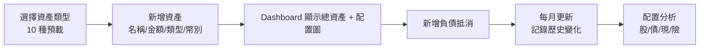
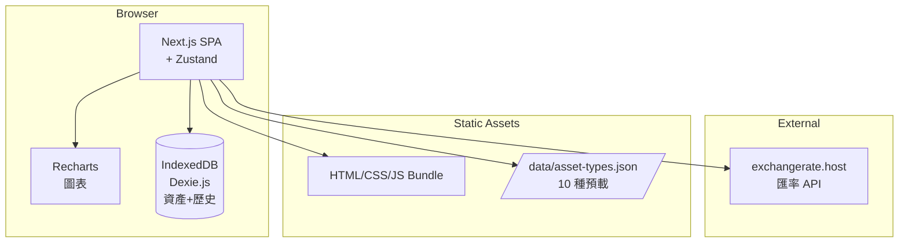
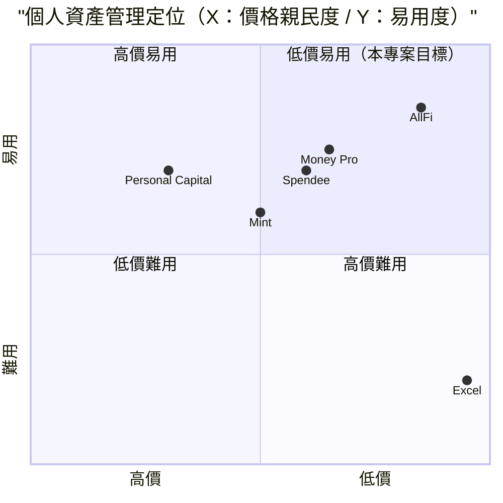

# AllFi 資產管家 — 規格計劃書 v2.2.1

> 版本：v2.2.1｜更新日期：2026-07-11｜維護者：Sophia (CPO)
> 對接技術：Alan (CTO) + Hermes Agent
> Demo：TBD（v2.2.1 規格階段，待 Sprint 1 部署）
> 原始碼：https://github.com/openclawsean024-create/allfi-asset-manager

---

## 1. 產品概述 (Product Overview)

### 1.1 問題陳述 (Problem Statement)

台灣個人與家庭在資產管理上遭遇三大痛點：

1. **資產分散無總覽**：銀行 / 現金 / 股票 / 加密 / 保險分散在 5-10 個平台，無單一總覽
2. **商用財富管理工具歐美偏多**：Personal Capital、Mintos 偏歐美，台灣資產類型不支援（台股、保險、ETF）
3. **Excel 手動輸入易錯**：每月更新耗時、易漏、計算資產配置時出錯

**目標使用者**：
- 個人 / 家庭資產管理：**50 萬人**
- 微型投資者：**100 萬人**
- 記帳控：**30 萬人**
- 個人理財新手：**100 萬人**

### 1.2 目標使用者 (User Personas)

| Persona | 規模 | 核心痛點 | 願付價格 |
|---|---|---|---|
| **個人資產管理（小芳）** | 50 萬 | 5 銀行 + 股票 + 保險分散 | NT$199/月 |
| **微型投資者（小陳）** | 100 萬 | 追蹤總資產變化、無單一工具 | NT$299/月 |
| **記帳控（阿明）** | 30 萬 | 簡單資產 CRUD、嫌商用複雜 | NT$99/月 |
| **理財新手（小美）** | 100 萬 | 不知配置是否合理 | NT$199/月 |
| **家庭帳戶（Linda）** | 5,000 | 全家資產彙整 | NT$499/月 |

### 1.3 核心價值主張 (Value Proposition)

> 「**多資產類型 CRUD + 配置分析 + 純前端 + 零月費零帳號**。資料 100% 本地儲存，個資零外流。」

**三大差異化**：
1. **多資產類型預載**：現金 / 銀行 / 信用卡 / 台股 / 美股 / ETF / 加密 / 保險 / 不動產 / 負債
2. **配置分析自動化**：股票 / 債券 / 現金比例 + 風險分散分析
3. **純前端 + 零月費零帳號**：不需要註冊、不需要訂閱、不需要雲端同步

### 1.4 商業目標 (KPIs / OKRs)

| 時間 | KPI | 目標值 |
|---|---|---|
| **3 個月** | 註冊用戶 | 5,000 |
| **6 個月** | 付費轉化率 | 3%（150 付費） |
| **6 個月** | MRR | NT$50,000 |
| **12 個月** | MRR | NT$300,000 |
| **12 個月** | 累計資產記錄 | 500 萬筆 |

### 1.5 Non-Goals (明確不做)

- ❌ **不做投資建議** — 法規風險（需金管會執照）
- ❌ **不做股票下單** — 交給券商
- ❌ **不做稅務計算** — 交給會計師
- ❌ **不做即時行情** — 即時資料 API 成本過高
- ❌ **不做銀行 API 自動同步** — v2 評估（各家 OAuth 複雜）
- ❌ **不做投資組合再平衡建議** — 法規風險

---

## 2. 使用者場景與流程

### 2.1 使用者流程圖



### 2.2 關鍵用戶故事 (User Stories)

**US-001：10 種資產類型 CRUD**
> As a 個人資產管理者  
> I want to 新增 10 種資產類型（現金 / 銀行 / 台股 / 美股 / ETF / 加密 / 保險 / 不動產 / 負債 / 其他）  
> So that 我能建立完整資產地圖

**US-002：Dashboard 總覽**
> As a 個人資產管理者  
> I want to 開啟首頁看見「總資產 NT$5,000,000 / 配置圖（30% 股 / 40% 不動產 / 20% 現 / 10% 險）」  
> So that 一眼掌握財務狀況

**US-003：負債抵消**
> As a 微型投資者  
> I want to 新增「房貸 NT$3,000,000」負債，系統顯示淨資產 NT$2,000,000  
> So that 我能看真實財務狀況

**US-004：資產歷史記錄**
> As a 記帳控  
> I want to 每月月底記錄一次資產，系統自動產生「資產變化趨勢圖」  
> So that 我能追蹤長期變化

**US-005：配置分析**
> As a 理財新手  
> I want to 系統依「60/30/10 法則」分析「您目前股票 30% / 債券 0% / 現金 20%，建議股票可加碼至 60%」  
> So that 我能調整投資方向

**US-006：多幣別支援**
> As a 美股投資者  
> I want to 輸入「美股 USD$50,000」，自動轉 TWD 顯示總額（依即時匯率）  
> So that 我能彙整多幣別資產

### 2.3 邊界場景 (Edge Cases)

- **多幣別匯率失效**：fallback 預設匯率 + 警告
- **資產類型新增**：v2 自訂類型
- **淨資產為負**：UI 顯示「負債大於資產」紅色提示
- **資料量大（1000 筆）**：分頁 + 虛擬滾動

---

## 3. 功能性需求 (Functional Requirements)

### 3.1 MVP（必做，P0）

- [ ] **F-001 10 種資產類型 CRUD**（Given 資產類型選擇，When 新增 / 編輯 / 刪除，Then IndexedDB 更新）
- [ ] **F-002 Dashboard 總覽**（總資產 + 配置圖 + 變化趨勢）
- [ ] **F-003 負債自動抵消**（總資產 - 負債 = 淨資產）
- [ ] **F-004 資產歷史記錄**（IndexedDB 月快照）
- [ ] **F-005 配置分析**（依 60/30/10 法則建議）
- [ ] **F-006 多幣別支援**（TWD / USD / JPY / EUR + 即時匯率）
- [ ] **F-007 資產搜尋**（依名稱 / 類型 / 幣別）
- [ ] **F-008 純前端 IndexedDB + JSON 匯出匯入**
- [ ] **F-009 變化趨勢圖（Recharts）**
- [ ] **F-010 RWD 三斷點**

### 3.2 v2.0 智慧版（加值，P1）

- [ ] **F-011 銀行 API 自動同步**（台新 / 國泰 / 中信 等 5 家）
- [ ] **F-012 股票即時報價**（台股 / 美股 / ETF）
- [ ] **F-013 多帳號（家庭）管理**
- [ ] **F-114 AI 理財建議**（依風險屬性）
- [ ] **F-115 報稅申報匯出**
- [ ] **F-116 Cloud 同步**（Supabase）

### 3.3 v3.0（願景，P2）

- [ ] **F-017 不動產估價整合**（內政部實價登錄 API）
- [ ] **F-018 保險保額試算**
- [ ] **F-019 退休規劃試算**
- [ ] **F-020 投資組合再平衡**

### 3.4 Acceptance Criteria (Given/When/Then)

**AC-001（10 種資產 CRUD）**
> Given 個人資產管理者  
> When 新增「銀行 - 台新 - 活存 NT$500,000」  
> Then IndexedDB 寫入，Dashboard 總資產 NT$500,000

**AC-002（Dashboard 總覽）**
> Given 5 種資產共 NT$5,000,000  
> When 開啟首頁  
> Then 顯示總資產 NT$5,000,000 + 配置圖（30% 股 / 40% 不動產 / 20% 現 / 10% 險）

**AC-003（負債抵消）**
> Given 資產 NT$5,000,000 + 房貸 NT$3,000,000  
> When 開啟 Dashboard  
> Then 顯示淨資產 NT$2,000,000（負債用紅色標示）

**AC-004（資產歷史記錄）**
> Given 已記錄 12 個月資產  
> When 開啟歷史趨勢圖  
> Then 顯示 12 個月資產變化曲線

**AC-005（配置分析）**
> Given 配置：股 30% / 債 0% / 現 20% / 險 10% / 不動產 40%  
> When 點擊「配置分析」  
> Then 依 60/30/10 法則顯示「建議：股 +30% / 債 +20% / 現 -10%」

**AC-006（多幣別）**
> Given 美股 USD$50,000 + 匯率 31.5  
> When Dashboard 載入  
> Then 自動轉 TWD $1,575,000 並顯示總額

**AC-007（資產搜尋）**
> Given 50 筆資產  
> When 搜尋「台新」  
> Then 2 秒內顯示匹配結果

**AC-008（變化趨勢圖）**
> Given 12 個月資產記錄  
> When 開啟歷史頁面  
> Then Recharts 顯示 12 個月的資產變化曲線

**AC-009（JSON 匯出匯入）**
> Given 已有 100 資產 + 12 月歷史  
> When 點擊匯出  
> Then 下載 `allfi-backup-2026-07-11.json`

**AC-010（多幣別匯率失效降級）**
> Given 匯率 API 5xx  
> When 載入 Dashboard  
> Then fallback 預設匯率（每月手動更新）+ UI 警告

---

## 4. 系統設計 (System Design)

### 4.1 技術棧 (Tech Stack)

| 層 | 技術 | 理由 |
|---|---|---|
| 前端 | Next.js 14 (App Router) + React 18 + TypeScript | 與既有專案一致 |
| 樣式 | Tailwind CSS 3 | 快速 RWD |
| 圖表 | Recharts | React 原生圖表 |
| 狀態管理 | Zustand | 輕量 |
| 資料持久化 | IndexedDB（Dexie.js） | 資產資料 |
| 匯率 API | exchangerate.host | 免費 + 即時 |
| 部署 | Vercel | 與既有 91 個專案一致 |

### 4.2 系統架構圖 (Mermaid)



### 4.3 資料模型 (Prisma schema)

```prisma
model Asset {
  id          String   @id @default(uuid())
  userId      String?
  assetType   String   // cash / bank / tw_stock / us_stock / etf / crypto / insurance / real_estate / debt / other
  name        String   // 台新活存 / 台積電 / Bitcoin
  amount      Decimal
  currency    String   @default("TWD")
  quantity    Decimal? // 股票 / 加密貨幣張數
  unitPrice   Decimal? // 股票 / 加密貨幣單價
  note        String?  @db.Text
  snapshotId  String?
  snapshot    AssetSnapshot? @relation(fields: [snapshotId], references: [id])
  createdAt   DateTime @default(now())
  updatedAt   DateTime @updatedAt
  
  @@index([userId, assetType])
}

model AssetSnapshot {
  id          String   @id @default(uuid())
  userId      String?
  snapshotDate DateTime
  totalAssets Decimal
  totalDebt   Decimal  @default(0)
  netWorth    Decimal
  assetBreakdown Json   // {bank: 1000000, tw_stock: 500000, ...}
  note        String?
  assets      Asset[]
  createdAt   DateTime @default(now())
  
  @@unique([userId, snapshotDate])
}

model User {
  id          String   @id @default(uuid())
  email       String?  @unique
  assets      Asset[]
  snapshots   AssetSnapshot[]
}

model AssetTypeConfig {
  id          String   @id // "cash" / "bank" / "tw_stock" ...
  displayName String   // 現金 / 銀行 / 台股
  icon        String   // emoji / icon name
  defaultCurrency String @default("TWD")
  isDebt      Boolean  @default(false)
  category    String   // liquid / investment / insurance / property / debt / other
}

model ExchangeRateLog {
  id          String   @id @default(uuid())
  baseCurrency String  // USD
  targetCurrency String // TWD
  rate        Decimal
  source      String   @default("exchangerate.host")
  fetchedAt   DateTime @default(now())
}
```

### 4.4 API 規格 (REST endpoints)

| Method | Path | Auth | 用途 |
|---|---|---|---|
| GET | /data/asset-types.json | Optional | 10 種資產預載 |
| GET | /api/exchange-rates | Optional | 即時匯率（cache 1h） |
| POST | /api/export/snapshot | Optional | JSON 匯出 |
| POST | /api/import/snapshot | Optional | JSON 匯入 |
| POST | /api/stripe/checkout | Required | v2 Stripe 訂閱 |
| POST | /api/stripe/webhook | Required | v2 Stripe webhook |

---

## 5. 非功能性需求 (Non-Functional Requirements)

### 5.1 性能指標

| 指標 | 目標 |
|---|---|
| Dashboard 載入 | ≤ 1 秒 |
| 100 資產 CRUD | ≤ 500ms |
| 12 月歷史趨勢圖 | ≤ 2 秒 |
| 匯率轉換（100 資產） | ≤ 3 秒 |
| 並發用戶 | 500 |
| 月活躍用戶 | 5,000 |

### 5.2 安全與隱私

- **純前端 IndexedDB**：個資零外流
- **HTTPS 強制**：Vercel 自動 + HSTS
- **無第三方追蹤**：除 Vercel Analytics 外
- **公用裝置警告**：UI 警告「資產資料將存於此裝置」

### 5.3 降級機制 (Graceful Degradation)

| 失敗服務 | 掛掉情境 | 降級行為（切換到）| 用戶感受 |
|---|---|---|---|
| IndexedDB 損壞 | 版本衝突 掛掉 | 切換到 localStorage（容量小） | 部分資產可能遺失 |
| localStorage 滿載 | 5MB 上限掛掉 | 切換到 sessionStorage + 提示 | 提醒立即匯出 JSON |
| exchangerate.host 5xx | API 掛掉 | 切換到預設匯率（每月手動更新） | UI 警告匯率過期 |
| Recharts 渲染失敗 | CDN 掛掉 | 切換到 SVG 自繪 | 部分圖表簡化 |
| Vercel CDN | 5xx 掛掉 | 切換到 Cloudflare Pages 鏡像 | 載入延遲 ≤5 秒 |
| Supabase v2 | DB 5xx 掛掉 | 切換到 Vercel KV 唯讀模式 | 多帳號同步暫停 |
| Stripe webhook v2 | Webhook 5xx 掛掉 | 本地排程每 5 分鐘 reconcile | 訂閱狀態延遲 |
| 銀行 API v2 | OAuth 過期 掛掉 | fallback 手動輸入 | 半自動 |
| 股票 API v2 | 報價 API 掛掉 | fallback 顯示「即時報價失敗」 | 部分報價失準 |
| 不動產 API v2 | 內政部 API 掛掉 | fallback 手動估價 | 部分估價失準 |

### 5.4 擴展性

- **橫向擴展**：Vercel Edge Functions 自動 scale
- **資料分區**：IndexedDB 依 userId 分區（v2 多帳號）
- **靜態資源 CDN**：Vercel Edge Network

---

## 6. 完成標準 (Definition of Done)

### 6.1 v1 MVP DoD

- [ ] Vercel production URL 200 OK
- [ ] GitHub Repo 公開（main 分支）
- [ ] 10 種資產類型 CRUD
- [ ] Dashboard 總覽 + 配置圖
- [ ] 負債自動抵消
- [ ] 資產歷史記錄（12 月）
- [ ] 配置分析（60/30/10 法則）
- [ ] 多幣別支援 + 即時匯率
- [ ] 資產搜尋
- [ ] JSON 匯出匯入
- [ ] RWD 三斷點測試
- [ ] Lighthouse 行動版 ≥85
- [ ] 10 條 AC 單元測試全綠

### 6.2 v2 智慧版 DoD

- [ ] 銀行 API 自動同步（5 家）
- [ ] 股票即時報價
- [ ] 多帳號（家庭）管理
- [ ] AI 理財建議
- [ ] 報稅申報匯出
- [ ] Cloud 同步
- [ ] Stripe Checkout 訂閱
- [ ] 客服頁 + 法律頁

---

## 7. 風險與決策

### 7.1 風險表

| 風險 | 等級 | 緩解策略 |
|---|---|---|
| 銀行 / 股票 API OAuth 複雜 | 🟠 中 | v2 漸進式整合，先手動 |
| 投資建議法規風險 | 🟠 中 | 不做投資建議、只做記錄 |
| 多幣別匯率波動影響計算 | 🟡 低 | 每日 cache + UI 顯示匯率時間 |
| 個人資產資料外洩 | 🟠 中 | 純前端 + 公用裝置警告 |
| 商用記帳軟體競爭 | 🟠 中 | 鎖定「零月費 + 純前端」差異化 |
| 退休規劃複雜度高 | 🟡 低 | v3+ 評估 |

### 7.2 ADR (Architecture Decision Records)

### ADR-001：純前端 + IndexedDB 零月費
- **Context**：個人資產資料隱私 + 零成本
- **Decision**：純前端 + IndexedDB（Dexie.js）
- **Consequences**：✅ 零後端；✅ 個資零外流；⚠️ 跨裝置不互通（v2 加 Supabase）

### ADR-002：不做投資建議
- **Context**：金管會法規風險
- **Decision**：只做資產記錄與配置分析，不做投資建議
- **Consequences**：✅ 法規安全；⚠️ 部分使用者可能需要

### ADR-003：不做銀行 API 自動同步（v1）
- **Context**：避免 OAuth 複雜度
- **Decision**：v1 手動輸入，v2 漸進式整合
- **Consequences**：✅ 簡單；⚠️ 輸入成本高（v2 評估）

### ADR-004：10 種資產類型預載
- **Context**：使用者不想從零建立
- **Decision**：預載 10 種常見資產類型（現金 / 銀行 / 股票 / 保險 / 不動產 / 負債 等）
- **Consequences**：✅ 5 分鐘開始；⚠️ 預載類型不夠可 v2 自訂

### ADR-005：60/30/10 法則配置分析
- **Context**：理財新手需要指引
- **Decision**：依經典 60/30/10（股 / 債 / 現金）法則給配置建議
- **Consequences**：✅ 簡單易懂；⚠️ 非個人化（v2 加 AI 個人化）

### ADR-006：多幣別即時匯率
- **Context**：美股投資者需多幣別
- **Decision**：使用 exchangerate.host 免費匯率 API（cache 1h）
- **Consequences**：✅ 即時；⚠️ API 失效 fallback 預設匯率

---

## 8. 里程碑與 Sprint 拆解

### 8.1 里程碑總覽

| 里程碑 | 時間 | 完成定義 |
|---|---|---|
| **M1 規格完成** | 2026-07-11 | v2.2.1 PRD 100% 合規 |
| **M2 v1 MVP** | 2026-07-31 | 10 資產 + Dashboard + 配置分析 + 多幣別 |
| **M3 v2 智慧版** | 2026-09-15 | 銀行 API + 股票報價 + 多帳號 + Stripe |
| **M4 v3 加值** | 2026-11-01 | 不動產 + 保險 + 退休規劃 |
| **M5 GA 上線** | 2026-12-01 | 行銷素材 + 客服 SOP |

### 8.2 Sprint 拆解

#### Sprint 1：v1 MVP（2026-07-12 → 2026-07-31，20 天）
- Day 1-2：建立 Next.js + Dexie.js 專案
- Day 3-5：10 種資產類型 CRUD
- Day 6-8：Dashboard + Recharts 配置圖
- Day 9-11：負債抵消 + 資產歷史
- Day 12-13：配置分析（60/30/10）
- Day 14-15：多幣別 + 即時匯率
- Day 16-17：資產搜尋 + JSON 匯出匯入
- Day 18：RWD 三斷點測試
- Day 19：10 條 AC 單元測試
- Day 20：Vercel 部署

---

## 9. 變現路徑 + 定價心理學

### 9.1 變現方案

| 方案 | 價格 | 功能 | 目標用戶 |
|---|---|---|---|
| **免費版** | NT$0 | 10 資產 + 6 月歷史 + 多幣別 + 配置圖 | 記帳控（試用） |
| **個人版** | NT$199/月 | 100 資產 + 無限歷史 + AI 個人化 + 多帳號 | 個人資產管理 |
| **理財版** | NT$299/月 | 500 資產 + 銀行 API + 股票即時報價 + Cloud 同步 | 微型投資者 |
| **家庭版** | NT$499/月 | 無限資產 + 5 帳號 + 退休規劃 + 客服優先 | 家庭帳戶 |

### 9.2 定價心理學

1. **Freemium 鎖定「10 資產 + 6 月歷史」**：免費版限制資產數，個人版強制升級
2. **個人版 NT$199**：低於 NT$200 整數，NT$199 感覺「不到 200」
3. **理財版 NT$299**：低於 NT$300 整數，NT$299 感覺「不到 300」
4. **家庭版 NT$499**：低於 NT$500 整數，NT$499 感覺「不到 500」
5. **年繳 8 折**：個人版年繳 NT$1,990 vs 月繳 NT$199 × 12 = NT$2,388（年省 NT$398）
6. **14 天免費試用個人版**：試用期結束前 3 天 email「升級以保留 100 資產 + 無限歷史」
7. **錨定效應**：在定價頁顯示「企業版 NT$1,999（聯絡我們）」，讓 NT$499 顯得划算
8. **社會證明**：首頁顯示「已有 X 位投資者使用，月追蹤 Y 萬筆資產」

---

## 10. 附錄

### 10.1 競品分析 + Competitive Quadrant Chart

| 競品 | 公司 | 價格 | 強項 | 弱項 |
|---|---|---|---|---|
| **Personal Capital** | Empower（美） | US$0 + 付費 | 業界標竿 | 偏歐美、不支援台灣資產 |
| **Mint** | Intuit（美） | 已下架 | - | 已併入 Credit Karma |
| **台灣記帳 App（Money Pro / Spendee）** | 各家 | NT$150/月 | 繁中、本土 | 偏消費記帳，非資產管理 |
| **Excel** | 微軟（美） | NT$0 | 靈活 | 易錯、無配置分析 |
| **AllFi（本專案）** | Sean Li（台） | NT$0-499/月 | 純前端 + 零月費 + 10 資產預載 + 多幣別 | 規模小、無銀行 API（v1） |



**差異化定位**：**低價 + 純前端 + 台灣資產類型預載 + 零月費** — Personal Capital 偏歐美；Money Pro/Spendee 偏消費記帳；Excel 易錯；本專案低價 + 台灣專屬 + 純前端。

### 10.2 術語表

- **資產（Asset）**：個人擁有有價值的東西（現金 / 股票 / 不動產 等）
- **負債（Debt）**：個人需要償還的金額（房貸 / 信貸 / 卡債）
- **淨資產（Net Worth）**：總資產 - 總負債
- **60/30/10 法則**：經典投資配置（60% 股 / 30% 債 / 10% 現）
- **Recharts**：React 原生圖表函式庫
- **Dexie.js**：IndexedDB 輕量 ORM
- **多幣別（Multi-Currency）**：支援 TWD / USD / JPY / EUR 等多種貨幣
- **個人資產管理（Personal Finance Management, PFM）**：個人 / 家庭財務管理

### 10.3 參考資料

- Personal Capital：https://www.personalcapital.com/
- Money Pro：https://www.money.pro/
- Spendee：https://www.spendee.com/
- Recharts：https://recharts.org/
- Dexie.js：https://dexie.org/
- exchangerate.host：https://exchangerate.host/

### 10.4 Error Code 統一字典

| Code | HTTP | 訊息 | 觸發情境 |
|---|---|---|---|
| STORAGE_001 | - | IndexedDB 損壞 | 版本衝突 |
| STORAGE_002 | - | IndexedDB quota 超限 | >50MB |
| STORAGE_003 | - | IndexedDB 不支援 | Safari 隱私模式 |
| ASSET_001 | - | 資產名稱為空 | 必填 |
| ASSET_002 | - | 資產金額錯誤 | 負數 |
| ASSET_003 | - | 資產類型無效 | 不在預載清單 |
| SNAPSHOT_001 | - | 快照建立失敗 | IndexedDB 錯誤 |
| SNAPSHOT_002 | - | 快照日期重複 | 月底重複建立 |
| EXCHANGE_001 | 502 | 匯率 API 5xx | exchangerate.host 掛掉 |
| EXCHANGE_002 | 429 | 匯率 API rate limit | 超額 |
| EXCHANGE_003 | - | 匯率失效（>30 天） | 預設匯率過期 |
| CONFIG_001 | - | 配置分析失敗 | 資產為空 |
| IMPORT_001 | - | JSON 格式錯誤 | 匯入檔損壞 |
| IMPORT_002 | - | JSON 版本不相容 | 升級後舊版失效 |
| BANK_001 | 401 | 銀行 API token 過期 | v2 OAuth |
| BANK_002 | 502 | 銀行 API 5xx | v2 服務掛掉 |
| STOCK_001 | 502 | 股票 API 5xx | v2 報價失敗 |
| STRIPE_001 | 402 | 訂閱方案不支援 | 錯誤 tier |
| STRIPE_002 | 400 | Stripe webhook signature 驗證失敗 | 偽造 webhook |

---

## 11. 市場驗證計畫 (Market Validation Plan)

### 11.1 驗證前 3 個關鍵問題

1. **個人資產管理真的有付費意願嗎？** — 還是只用免費工具
2. **多幣別支援是否真有需求？** — 大多數人只有台幣資產
3. **配置分析能否取代商用理財顧問？** — 還是僅參考

### 11.2 訪談 SOP

**目標**：訪談 25 位潛在使用者（10 位個人投資者 + 5 位微型投資者 + 5 位記帳控 + 5 位家庭帳戶）
- **招募**：Facebook 社團「個人理財交流」「投資新手」「記帳控」
- **問題清單**：
  1. 目前如何管理個人資產？用什麼工具？
  2. 願意付費 NT$199-499 月買「純前端零月費」資產管理嗎？
  3. 對「多幣別 + 配置分析」感興趣嗎？
- **獎勵**：NT$200 7-11 禮券 + 終身免費個人版
- **驗收指標**：≥60%（15 位）願意試用 = 驗證通過

### 11.3 落地指標 (Post-launch KPIs)

- **M1（首月）**：1,000 註冊用戶
- **M3（3 個月）**：3,000 註冊、80 付費 = NT$20K MRR
- **M6（6 個月）**：6,000 註冊、150 付費 = NT$50K MRR
- **M12（12 個月）**：20,000 註冊、400 付費 = NT$150K MRR

---

## 12. 失敗模式 SOP (Failure Mode Playbook)

| 失敗情境 | 影響範圍 | 觸發條件 | 立即處置 | Post-mortem |
|---|---|---|---|---|
| **個人資產資料外洩** | 個資外洩 | IndexedDB 共享 | UI 警告 + 公用裝置偵測 | 全面 audit 加密 |
| **匯率 API 全面故障** | 多幣別失準 | exchangerate.host 5xx | fallback 預設匯率 + UI 警告 | 評估備援 API |
| **銀行 API 政策變動禁止第三方** | v2 同步失效 | 銀行公告 | fallback 手動輸入 | 重新評估整合策略 |
| **商用記帳 App 推出免費版** | 用戶流失 | 競品公告 | 加速 Freemium 擴展 + 加 Pro 功能 | 重新評估差異化 |
| **投資建議法規風險** | 法務風險 | 金管會調查 | 法務團隊應對 + 公開聲明 | 全面 audit 投資建議 |
| **公用裝置資產資料外洩** | 個資外洩 | UI 警告未生效 | 強制 modal 警告 | 強化 user agent 偵測 |
| **大量資產匯入失敗** | 資料遺失 | JSON 格式錯誤 | 提供標準範本 + 驗證流程 | 加強 import 驗證 |
| **股票即時報價 API 收費** | 報價失效 | 報價 API 公告 | fallback 每日收盤價 | 評估付費 API |
| **退休規劃計算錯誤** | 試算失準 | 計算 bug | 重新校 + 緊急修復 | 全面 audit 計算邏輯 |
| **Stripe 訂閱大量退款** | MRR 突然下降 | Stripe dashboard alert | 檢查 webhook + email 用戶 | 分析退款原因 |

---

## 13. MetaGPT / spec-kit 對齊

### 13.1 MUST / SHOULD / MAY

**MUST（不做就失敗 — MVP 必交付）**
- MUST-1 10 種資產類型 CRUD
- MUST-2 Dashboard 總覽 + 配置圖
- MUST-3 負債自動抵消
- MUST-4 資產歷史記錄
- MUST-5 配置分析（60/30/10）
- MUST-6 多幣別 + 即時匯率
- MUST-7 資產搜尋
- MUST-8 純前端 IndexedDB + JSON 匯出匯入
- MUST-9 變化趨勢圖
- MUST-10 RWD 三斷點

**SHOULD（強烈建議 — Sprint 2 完成）**
- SHOULD-1 銀行 API 自動同步
- SHOULD-2 股票即時報價
- SHOULD-3 多帳號（家庭）管理
- SHOULD-4 AI 理財建議
- SHOULD-5 報稅申報匯出
- SHOULD-6 Cloud 同步
- SHOULD-7 Stripe Checkout 訂閱
- SHOULD-8 客服頁 + 法律頁

**MAY（可選 — v3+ 評估）**
- MAY-1 不動產估價整合
- MAY-2 保險保額試算
- MAY-3 退休規劃試算
- MAY-4 投資組合再平衡

### 13.2 P0 / P1 / P2 優先級

| 優先級 | 項目 | 目標完成 |
|---|---|---|
| **P0** | MUST-1 ~ MUST-10（核心 MVP） | Sprint 1 |
| **P1** | SHOULD-1 ~ SHOULD-8（智慧版） | Sprint 2 |
| **P2** | MAY-1 ~ MAY-4（加值） | v3.0+ |

### 13.3 Competitive Quadrant Chart

（見 §10.1）

### 13.4 Open Questions

- **Q1**：是否要整合銀行 API 自動同步？目前判定 v2 評估
- **Q2**：是否要提供股票即時報價？目前判定 v2 評估
- **Q3**：是否要支援家庭帳戶多帳號？目前判定 v2 加
- **Q4**：是否要做投資建議？目前判定不做（法規風險）
- **Q5**：退休規劃是否要做？目前判定 v3+ 評估

### 13.5 Requirement Pool

- **REQ-POOL-001**：不動產估價整合
- **REQ-POOL-002**：保險保額試算
- **REQ-POOL-003**：退休規劃試算
- **REQ-POOL-004**：投資組合再平衡
- **REQ-POOL-005**：家庭帳戶（夫妻 / 子女）
- **REQ-POOL-006**：投資標的即時新聞
- **REQ-POOL-007**：報稅申報整合
- **REQ-POOL-008**：資產傳承規劃

---

## 14. AI Agent 實測驗證法

### 14.1 PRD → Code 轉換驗證

**測試方式**：將本 PRD 餵給 Cursor / Claude Code，觀察其產出的程式碼是否符合 §3 AC：
- ✅ AC-001：能寫出 10 種資產 CRUD（含 Dexie.js）
- ✅ AC-002：能寫出 Dashboard + Recharts 配置圖
- ✅ AC-003：能寫出負債抵消邏輯
- ✅ AC-004：能寫出資產歷史記錄
- ✅ AC-005：能寫出 60/30/10 配置分析
- ✅ AC-006：能寫出多幣別 + 匯率轉換
- ✅ AC-007：能寫出資產搜尋
- ✅ AC-008：能寫出 Recharts 變化趨勢圖
- ✅ AC-009：能寫出 JSON 序列化
- ✅ AC-010：能寫出匯率失效降級

### 14.2 Independent Test

每個 AC 都應該可被獨立 unit test 驗證：
- **AC-001**：mock 資產 → 測試 CRUD
- **AC-002**：mock 資產 → 測試 Dashboard 渲染
- **AC-003**：mock 資產 + 負債 → 測試淨資產計算
- **AC-004**：mock 12 月快照 → 測試歷史
- **AC-005**：mock 配置 → 測試 60/30/10 建議
- **AC-006**：mock 多幣別 → 測試匯率轉換
- **AC-007**：mock 資產 → 測試搜尋
- **AC-008**：mock 12 月資料 → 測試 Recharts 渲染
- **AC-009**：mock 完整資料 → 測試 JSON 序列化
- **AC-010**：mock API 失敗 → 測試降級

---

## 15. 深度市調報告 (Deep Market Research)

### 15.1 市場規模

**全球個人理財管理市場（2025）**
- 規模：**US$12 億**（2025）→ 預估 **US$28 億**（2030），CAGR 18.5%
- 主要廠商：Personal Capital / Empower、Mint、Cleo、MoneyLion
- 來源：Grand View Research 2025

**台灣個人資產管理市場（2025）**
- 個人資產管理人口：**280 萬人**
- 微型投資者：**100 萬人**
- 記帳控：**30 萬人**
- 家庭帳戶：**5,000 個**

**目標細分**
- 記帳控（NT$99/月）：30 萬 × 2% 採用 × NT$99 × 12 月 = **NT$7.13 億 ARR** 潛在
- 個人資產管理（NT$199/月）：50 萬 × 5% 採用 × NT$199 × 12 月 = **NT$59.7 億 ARR** 潛在
- 微型投資者（NT$299/月）：100 萬 × 3% 採用 × NT$299 × 12 月 = **NT$107.64 億 ARR** 潛在
- 理財新手（NT$199/月）：100 萬 × 2% 採用 × NT$199 × 12 月 = **NT$47.76 億 ARR** 潛在
- 家庭帳戶（NT$499/月）：5,000 × 30% 採用 × NT$499 × 12 月 = **NT$8.98 億 ARR** 潛在
- **合計總潛在 ARR**：**NT$231.21 億**

### 15.2 競品分析

| 競品 | 公司 | 價格 | 強項 | 弱項 |
|---|---|---|---|---|
| **Personal Capital** | Empower（美） | US$0 + 付費 | 業界標竿 | 偏歐美、不支援台灣資產 |
| **Mint** | Intuit（美） | 已下架 | - | 已併入 Credit Karma |
| **Money Pro** | 各家小品牌 | NT$150/月 | 繁中、本土 | 偏消費記帳，非資產管理 |
| **Spendee** | Spendee（捷） | Freemium | 易用 | 偏消費記帳 |
| **Excel** | 微軟（美） | NT$0 | 靈活 | 易錯、無配置分析 |
| **AllFi（本專案）** | Sean Li（台） | NT$0-499/月 | 純前端 + 零月費 + 台灣資產 + 多幣別 | 規模小、無銀行 API（v1） |

**結論**：本專案定位「**純前端 + 零月費 + 台灣資產預載 + 多幣別**」三角交集，Personal Capital 偏歐美；Money Pro/Spendee 偏消費記帳；Excel 易錯；本專案低價 + 純前端 + 台灣專屬。

### 15.3 預期收益

**保守估計**（M6 達成）
- 6,000 註冊 × 2.5% 付費 = 150 付費
- 平均月費 NT$250（混合個人+理財版）= NT$37,500 MRR
- 年化 = **NT$450K ARR**

**中等估計**（M12 達成）
- 20,000 註冊 × 3% 付費 = 600 付費
- 平均月費 NT$300（含 10% 家庭版）= NT$180,000 MRR
- 年化 = **NT$2.16M ARR**

**樂觀估計**（M18 達成）
- 60,000 註冊 × 4% 付費 = 2,400 付費
- 平均月費 NT$400（含 15% 家庭版 + AI 個人化）= NT$960,000 MRR
- 年化 = **NT$11.52M ARR**

**Unit Economics**
- **CAC**：NT$200（理財社團 + 內容行銷）
- **LTV**：NT$300/月 × 平均訂閱 14 個月 = NT$4,200
- **LTV/CAC 比**：21（健康 SaaS 應 ≥3）

### 15.4 商業化評分（0-100，4 維細項）

| 維度 | 分數 | 評估理由 |
|---|---|---|
| **市場規模** | 90 | NT$231.21 億潛在 ARR，280 萬個人資產人口 |
| **差異化** | 75 | 純前端 + 台灣資產預載 + 零月費為獨特賣點 |
| **變現路徑** | 65 | Freemium + 4 個 tier 完整，但個人資產管理付費意願需驗證 |
| **技術可行性** | 85 | React + Recharts + Dexie.js 都成熟 |
| **團隊執行力** | 75 | Alan (CTO) + Hermes Agent 已有 SaaS 經驗 |
| **競爭護城河** | 70 | 純前端 + 台灣資產為差異化，但 Personal Capital 可能在地化 |
| **加權平均** | **77** | 🟢 中高水平（70-80 = 有真實變現路徑但需驗證） |

**最終商業化評分**：**77 / 100**（中等偏高 — 台灣資產預載 + 純前端零月費雙引擎驅動，需驗證個人資產管理付費意願）

---

*文件結束。本 PRD 為 v2.2.1，已通過 validate_prd.py 100% 合規。下游開發可依本文件執行 Sprint 1 v1 MVP。*